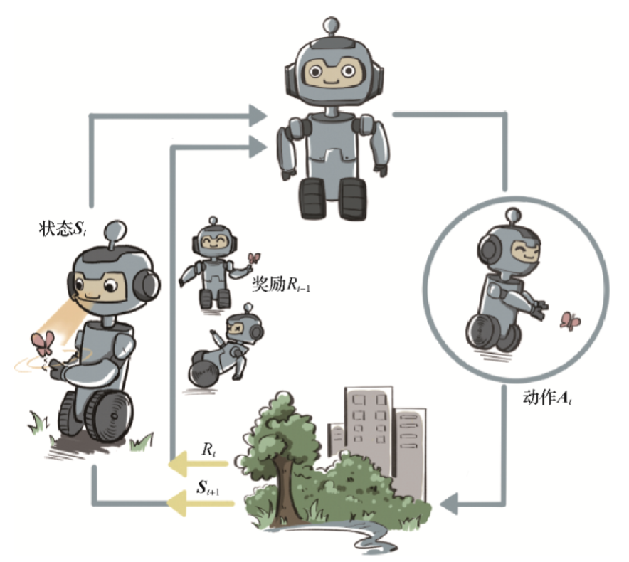

# Reinforcement Learning

> Collated from  SJTU course-Reinforcement Learnings

## 1. 简介

### 1.1 序贯决策（sequential decision making）

决策和预测任务不同，决策往往会带来“后果”，因此决策者需要为未来负责，在未来的时间点做出进一步的决策。实现序贯决策的机器学习方法就是强化学习（reinforcement learning）。预测仅仅产生一个针对输入数据的信号，并期望它和未来可观测到的信号一致，这不会使未来情况发生任何改变。

### 1.2 强化学习的概念

强化学习是机器通过与环境交互来实现目标的一种计算方法。机器和环境的一轮交互是指，机器在环境的一个状态下做一个动作决策，把这个动作作用到环境当中，这个环境发生相应的改变并且将相应的奖励反馈和下一轮状态传回机器。这种交互是迭代进行的，机器的目标是最大化在多轮交互过程中获得的累积奖励的期望。

## 2. Exploration vs. Exploitation（多臂老虎机，MAB）

**在“探索拉杆的获奖概率”和“根据经验选择获奖最多的拉杆”中进行权衡**。

一种简化版的强化学习问题。与强化学习不同，多臂老虎机不存在状态信息，只有动作和奖励，算是最简单的“和环境交互中的学习”的一种形式。在“探索拉杆的获奖概率”和“根据经验选择获奖最多的拉杆”中进行权衡。

### 2.1 $\epsilon$-贪心算法

$$
a_t=\begin{cases}
\arg \max_{a\in A} \hat Q(a),采样概率为1-\epsilon\\
从A中随机选择,采样概率为\epsilon
\end{cases}
$$

其中，令$\epsilon$随时间衰减，$\epsilon = \frac{1}{t}$

### 2.2 上置信界算法

**霍夫丁不等式：**令$X_1$,...,$X_n$为$n$个独立同分布的随机变量，取值范围为$[0,1]$，其经验期望为$\overline x_n=\frac{1}{n}\sum^{n}_{j=1}X_j$，则有
$$
\mathbb P \{ \mathbb E [X] \ge 
\overline x_n+u \}\le e^{-2nu^2}
$$
根据该不等式，在MAB问题中，每次选择拉杆前，先估计每根拉杆的期望奖励的上界，使得拉动每根拉杆的期望奖励只有一个较小的概率$p(p=\frac {1}{t})$超过这个上界，接着选出期望奖励上界最大的拉杆，从而选择最有可能获得最大期望奖励的拉杆。$c$用于控制不确定性的比重。
$$
a=\arg \max_{a \in A} \ [\hat Q(a)+c \cdot \hat U(a)]
$$

$$
	\hat U_t(a)=\sqrt {\frac {\ln t}{2(N_t(a)+1)}}
$$

​	（$N_t(a)+1$的原因是防止出现分母为0的情况）

### 2.3 汤普森采样算法

先假设拉动每根拉杆的奖励服从一个特定的概率分布，然后根据拉动每根拉杆的期望奖励来进行选择。在实际情况中，我们通常用 Beta 分布对当前每个动作的奖励概率分布进行建模。具体来说，若某拉杆被选择了$k$次，其中$m_1$次奖励为1，$m_2$次奖励为0，则该拉杆的奖励服从参数为$(m_1+1,m_2+1)$的 Beta 分布。

汤普森采样是一种计算所有拉杆的最高奖励概率的**蒙特卡洛采样方法**。

## 3. Markov decision process（马尔可夫决策过程，MDP）

### 3.1 马尔可夫链

1. **状态空间 States Space**
   $$
   S=\{s_1,s_2,...s_n\}
   $$

2. **无记忆性 Memorylessness**

   下一状态的概率分布只能由当前状态决定，在时间序列中它前面的事件均与之无关。
   $$
   Pr(X_{n+1}=x \ |\ X_1=x_1,X_2=x_2,...,X_n=x_n)=Pr(X_{n+1}=x\ |\ X_n=x_n)
   $$

3. **转移矩阵 Transition Matrix**

$$
P=\left[
\begin{matrix}
 P(s_1|s_1)  & \cdots & P(s_n|s_1)   \\
 \vdots      & \ddots & \vdots       \\
 P(s_1|s_n)  & \cdots & P(s_n|s_n)   \\
\end{matrix}
\right]
$$

### 3.2 马尔可夫奖励过程（MRP）

- **回报**

  从第$t$时刻状态$S_t$开始，直到终止状态时，所有奖励的衰减之和
  $$
  G_t = R_t + \gamma R_{t+1} + \gamma^2R_{t+2} + \cdot \cdot \cdot = \sum ^{\infin} _{k=0}\gamma^kR_{t+k}
  $$

- **价值函数**

  即所有状态的期望回报（即从这个状态出发的未来累计奖励的期望）
  $$
  V(s) = \mathbb E[G_t|S_t=s]=\mathbb E[R_t+\gamma V(S_{t+1})|S_t=s] = r(s)+\gamma \sum_{s'\in S}p(s'|s)V(s')
  $$

​	上式就是**贝尔曼方程**，将其写成矩阵形式为
$$
\mathcal V = \mathcal R + \gamma \mathcal P \mathcal V 
$$
​	解析解为
$$
\mathcal V = (I-\gamma \mathcal P)^{-1} \mathcal R
$$
​	该解的计算复杂度为$O(n^3)$，其中$n$是状态的个数。

### 3.3 马尔可夫决策过程

#### 3.3.1 内容

**Def：**在每个时间步骤中，随机过程都处于某种状态$s$，决策者可以选择在状态$s$下可用的动作$a$。 该随机过程在下一时间步骤会随机进入新状态$s'$，并给予决策者相应的回馈$R_a(s,s')$。

马尔可夫决策过程是马尔可夫链的推广，不同之处在于添加了**行动（允许选择）和奖励（给予动机）**。反过来说，如果每个状态只存在一个操作和所有的奖励都是一样的，一个马尔可夫决策过程可以归结为一个马尔可夫链。

马尔可夫决策过程是一个4元组$(S,A,P_a,R_a)$，其中，

​	$S$是状态空间的集合

​	$A$是动作空间的集合，也被称为动作空间（比如$A_s$是状态$s$中的可用动作集合）

​	$P_a(s,s')=Pr(s_{t+1}=s'\ | \ s_t=s,a_t=a)$是$t$时刻$s$状态下的动作$a$导致$t+1$时刻进入状态$s'$的概率

​	$R_a(s,s')$状态$s$经过动作$a$转换到状态$s'$后收到的即时奖励（或预期的即时奖励）

策略函数$\pi$是从状态空间（$S$）到动作空间（$A$）的（潜在概率）映射。

马尔可夫决策过程的目标是为决策者找到一个好的“策略”：指定决策者在状态$s$时将选择的动作$\pi(s) = \pi(a|s) = P(A_t=a|S_t=s)$，一旦以这种方式将马尔可夫决策过程与策略组合在一起，就可以确定在每个状态的动作，并且生成的组合行为类似于马尔可夫链（因为在状态$s$的动作都由$\pi(s)$决定，$Pr(s_{t+1}=s'∣s_t=s,a_t=a)$简化为$Pr(s_{t+1}=s′∣s_t=s)$，成为一个马尔可夫转移矩阵）

目标是选择一个策略$\pi$，使随机奖励的累积函数最大化，通常是在潜在的无限范围内的预期贴现总和
$$
E\left[ \sum _{t=0}^{\infty} \gamma^tR_{a_t}(s_t,s_{t+1}) \right]\\
(G_t = R_t + \gamma R_{t+1} + \gamma^2 R_{t+2} + \cdot \cdot \cdot= \sum ^{\infin}_{k=0}\gamma^kR_{t+k})\\
$$

其中，$\gamma $是折现因子，满足$0\leq\gamma\leq1$，通常接近于1。较低的折现因子促使决策者倾向于尽早采取行动，而不是无限期地推迟行动。

使上述函数最大化的策略称为最优策略，通常用$\pi^*$表示。一个特定的MDP可能有多个不同的最佳策略。

- **状态价值函数**
  $$
  V^{\pi}(s)=\mathbb E_\pi[G_t|S_t=s]
  $$

- **动作价值函数**

  MDP在遵循策略$\pi$时，对当前状态$s$执行动作$a$得到的期望回报：
  $$
  Q^{\pi}(s,a)=\mathbb E[G_t|S_t=s,A_t=a]
  $$
  状态$s$下采取动作$a$的价值等于即时奖励加上经过衰减后的所有可能的下一状态的状态转移概率与相应的价值的乘积：
  $$
  Q^\pi(s,a)=r(s,a)+\gamma\sum_{s' \in S}P(s'|s,a)V^\pi(s')
  $$

状态价值函数和动作价值函数之间的关系：
$$
V^{\pi}(s)=\sum_{a\in A}\pi(a|s)Q^{\pi}(s,a)
$$
通过简单的推导，得到两个价值的**贝尔曼期望方程**：
$$
V^{\pi}(s) = \mathbb E_\pi[R_t+\gamma V^{\pi}(S_{t+1})|S_t=s] = \sum_{a \in A}\pi(a|s)\left(r(s,a)+\gamma \sum_{s'\in S}p(s'|s,a)V^{\pi}(s')\right )
$$

$$
Q^\pi(s,a)=r(s,a)+\gamma \sum_{s'\in S}p(s'|s,a)V^{\pi}(s')=r(s,a)+\gamma \sum_{s'\in S}p(s'|s,a)\sum_{a' \in A}\pi(a'|s')Q^\pi(s',a')
$$

对于价值函数的计算，我们可以将策略的动作选择进行边缘化，就可以得到没有动作的MRP，再采用MRP的解析方式即可求解，但是，当状态动作集合比较大的时候， MRP解析解的方法不再适用，这时我们可以采用蒙特卡洛方法来近似估计价值函数。

- **蒙特卡洛方法**

  用策略$\pi$从状态$s$开始采样序列，据此来计算状态价值
  $$
  V^{\pi}(s) = \mathbb E_\pi [G_t | S_t = s] \approx \frac{1}{N} \sum^N_{i=1}G_t^{(i)}
  $$

​	计算状态价值时，我们可以采用增量式的更新方法
$$
N(s)\leftarrow N(s)+1\\
V(s)\leftarrow V(s)+\frac{1}{N(s)}(G-V(s))
$$

#### 3.3.2 占用度量

不同策略的价值函数是不一样的，这是由于不同策略会访问到的状态的概率分布是不同的。定义MDP的初始状态分布为$\nu_0(s)$，用$P_t^\pi(s)$表示采取策略$\pi$使得智能体在$t$时刻状态为$s$的概率，我们有$P_0^\pi(s)=\nu_0(s)$，然后就可以定义一个策略的**状态访问分布**
$$
\nu^\pi(s)=(1-\gamma)\sum^\infin_{t=0}\gamma^tP_t^\pi(s)
$$
其中，$1-\gamma$用来使得概率加和为1的归一化因子，状态访问概率有如下性质：
$$
\nu^\pi(s')=(1-\gamma)\nu_0(s')+\gamma\int P(s'|s,a)\pi(a|s)\nu^\pi(s)dsda
$$
此外，我们还可以定义策略的**占用度量**：
$$
\rho^\pi(s,a) = (1-\gamma)\sum^\infin_{t=0}\gamma^tP_t^\pi(s)\pi(a|s)
$$
表示动作状态对$(s,a)$被访问到的概率，两者的关系：
$$
\rho^\pi(s,a) = \nu^\pi(s)\pi(a|s)
$$
**定理1:**

智能体分别以策略$\pi_1$和$\pi_2$和同一个MDP交互得到的占用度量$\rho^{\pi_1}$和$\rho^{\pi_2}$满足
$$
\rho ^{\pi_1} = \rho ^{\pi_2} \Leftrightarrow \pi_1 = \pi_2
$$
**定理2:**

给定一合法（存在）占用度量$\rho$，可生成该占用度量的唯一策略是
$$
\pi_\rho = \frac {\rho(s,a)}{\sum_{a'} \rho(s,a')}
$$

#### 3.3.3 最优策略

**Def：**当且仅当对于任意的状态$s$都有$V^\pi(s)\ge V^{\pi'}(s)$，记$\pi > \pi' $，这个策略被称作最优策略，最优策略可能有多种，将其表示为$\pi^*(s)$。

最优策略都有相同的状态价值函数，我们称之为最优状态价值函数，表示为：
$$
V^*(s) = \max_\pi V^\pi(s),\forall s\in\mathcal S
$$
同理，我们定义最有价值函数：
$$
Q^*(s,a)=\max_\pi Q^\pi(s,a), \forall s \in \mathcal S,a\in\mathcal A
$$
根据式（22），我们可以得到最优状态价值函数和最优动作价值函数之间的关系：
$$
Q^*(s,a)=r(s,a)+\gamma\sum_{s' \in S}P(s'|s,a)V^*(s')
$$
同时，最优状态价值是选择此时使最优动作价值最大的那一个动作时的状态价值：
$$
V^*(s)=\max_{a\in\mathcal A}Q^*(s,a)
$$
根据式（35）和式（36），我们就可以得到**贝尔曼最优方程**:
$$
V^*(s)=\max_{a\in\mathcal A}\{r(s,a)+\gamma\sum_{s' \in S}P(s'|s,a)V^*(s')\}
$$

$$
Q^*(s,a) = r(s,a) + \gamma \sum_{s' \in \mathcal S}p(s'|s,a) \max_{a' \in \mathcal A} Q^*(s',a')
$$

## 4. Dynamic programming（动态规划算法）

动态规划的基本思想是将待求解问题分解成若干个子问题，先求解子问题，然后从这些子问题的解得到目标问题的解。动态规划会保存已解决的子问题的答案，在求解目标问题的过程中，需要这些子问题答案时就可以直接利用，避免重复计算。

### 4.1 策略迭代

策略迭代由两部分组成：**策略评估**（policy evaluation）和**策略提升**（policy improvement）。

#### 4.1.1 策略评估

根据贝尔曼期望方程和动态规划的思想
$$
V^{k+1}(s)= \sum_{a \in A}\pi(a|s)\left(r(s,a)+\gamma \sum_{s'\in S}p(s'|s,a)V^{k}(s')\right )
$$
选定任意的初始值$V^0$。可以得知$V^k=V^\pi$是以上更新公式的一个不动点，当$k\rightarrow \infin$时，序列${V^k}$会收敛到$V^\pi$，在实际的实现过程中，设定当某一轮的$\max_{s \in \mathcal S}|V^{k+1}(s)-V^{k}(s)|$的值非常小，提前结束迭代。

#### 4.1.2 策略提升

**策略提升定理**：假设存在一个确定性策略$\pi'$，在任意状态$s$下，都满足
$$
Q^\pi(s,\pi'(s))\ge V^\pi(s)
$$
于是在任意状态下，我们有
$$
V^{\pi'}(s) \ge V^\pi(s)
$$
根据策略提升定理，我们可以贪心地在每一个状态选择动作价值最大的动作，也就是
$$
\pi'(s) = \arg \max_a Q^\pi(s,a) = \arg \max_a \{r(s,a)+\gamma\sum_{s'}P(s'|s,a)V^\pi(s')\}
$$
当策略提升之后得到的策略$\pi$和之前的策略$\pi'$一样时，说明策略迭代达到了收敛，此时$\pi$和$\pi'$就是最优策略。

策略迭代算法的过程如下：对当前的策略进行策略评估，得到其状态价值函数，然后根据该状态价值函数进行策略提升以得到一个更好的新策略，接着继续评估新策略、提升策略……直至最后收敛到最优策略。

### 4.2 价值迭代算法

价值迭代利用的是贝尔曼最优方程。**（价值迭代中不存在显式的策略，我们只维护一个状态价值函数）**
$$
V^{k+1}(s) = \max_{a \in \mathcal A}\{ r(s,a)+\gamma \sum_{s'\in S}p(s'|s,a)V^{k}(s') \}
$$
同样地，进行迭代直到$V^{k+1}$和$V^k$相同时，此时对应着最优价值函数$V^*$。

我们利用
$$
\pi(s)= \arg \max_a \{r(s,a)+\gamma\sum_{s'}P(s'|s,a)V^{k+1}(s')\}
$$
从中恢复出最优策略即可。

## 5. Temporal difference（时序差分算法）

机器学习的主要方法都是在数据分布未知的情况下针对具体的数据点来对模型做出更新的。对于大部分强化学习现实场景（例如电子游戏或者一些复杂物理环境），其马尔可夫决策过程的状态转移概率是无法写出来的，也就无法直接进行动态规划。在这种情况下，智能体只能和环境进行交互，通过采样到的数据来学习，这类学习方法统称为**无模型的强化学习**（model-free reinforcement learning）。

无模型的强化学习中的两大经典算法：Sarsa 和 Q-learning，它们都是基于**时序差分**（temporal difference，TD）的强化学习算法。

时序差分算法结合了**蒙特卡洛**和**动态规划**算法的思想。时序差分方法和蒙特卡洛的相似之处在于可以从样本数据中学习，不需要事先知道环境；和动态规划的相似之处在于根据贝尔曼方程的思想，利用后续状态的价值估计来更新当前状态的价值估计。

蒙特卡洛方法对价值函数的增量更新方法：
$$
V(s_t) \leftarrow V(s_t) + \alpha [G_t-V(s_t)]
$$
这里的$\alpha$取为一个常数，此时更新方式不再像蒙特卡洛方法那样严格地取期望。

蒙特卡洛方法必须要等整个序列结束之后才能计算得到这一次的回报$G_t$，我们继续用$r_t+\gamma V(s_{t+1})$来替代$G_t$。
$$
V(s_t) \leftarrow V(s_t) + \alpha[r_t+\gamma V(s_{t+1})-V(s_t)]
$$
证明过程如下：
$$
V_\pi = \mathbb E_\pi[G_t|S_t=s] = \mathbb E_\pi[\sum_{k=0}^{\infin}\gamma^kR_{t+k}|S_t=s] = \mathbb E_\pi[R_t+\gamma \sum_{k=0}^{\infin}\gamma^kR_{t+k+1}|S_t=s] = \mathbb E_\pi[R_t+\gamma V_\pi(S_{t+1})|S_t=s]
$$

### 5.1 Sarsa算法

直接用时序差分算法来估计动作价值函数$Q$：
$$
Q(s_t,a_t) \leftarrow Q(s_t,a_t) + \alpha[r_t+\gamma Q(s_{t+1},a_{t+1})-Q(s_t,a_t)]
$$
用$\epsilon$-贪婪算法来选取在某个状态下动作价值最大的那个动作：
$$
\pi(a|s) = \begin{cases}
\epsilon /|\mathcal A|+1-\epsilon \ \ \ \ 如果a = arg \max_{a'} Q(s,a')\\
\epsilon /|\mathcal A| \ \ \ \ \ \ \ \ \ \ \ \ \ \ \ \ \ 其他动作
\end{cases}
$$

### 5.2 多步Sarsa算法

$$
Q(s_t,a_t) \leftarrow Q(s_t,a_t) + \alpha[r_t+\gamma r_{t+1}+\cdot \cdot \cdot \gamma^n Q(s_{t+n},a_{t+n})-Q(s_t,a_t)]
$$

### 5.3 Q-learning算法

$$
Q(s_t,a_t) \leftarrow Q(s_t,a_t) + \alpha[r_t+\gamma \max_a Q(s_{t+1},a)-Q(s_t,a_t)]
$$

我们可以用价值迭代的思想来理解Q-learning，即Q-learning是直接在估计$Q^*$

动作价值函数的贝尔曼最优方程：
$$
Q^*(s,a) = r(s,a) + \gamma \sum_{s' \in \mathcal S}p(s'|s,a) \max_{a' \in \mathcal A} Q^*(s',a')
$$
Q-learning的更新可以根据任意给定的$(s,a,r,s')$来更新$Q$，被称为**离线策略算法**，而sarsa算法必须使用当前的$\epsilon$-贪婪策略来采样得到数据，因为它的更新中用到的$Q(s',a')$的$a'$是当前策略在$s'$下的动作，被称为**在线策略算法**。

### 5.4 Dyna-Q算法

一个经典的**基于模型**的强化学习算法，使用Q-planning的方法来基于模型生成一些模拟数据，然后用模拟数据和真实数据一起改进策略。

Q-panning每次选取一个曾经访问过的状态$s$，采取一个曾经在该状态下执行过的动作$a$，通过模型得到转移后的状态$s'$以及奖励$r$，并根据这个模拟数据$(s,a,r,s')$，用Q-learning的更新方式来更新动作价值函数。

## 6. DQN算法

Q-learning算法中环境的状态和动作都是离散的，可以建立一张存储每个状态下所有动作$Q$值的表格，但是，当状态或者动作数量非常大的时候，我们需要用**函数拟合**的方式估计$Q$，使用一个参数化的函数$Q_\theta$来拟合这些数据。函数拟合的方法存在一定的精度损失，因此被称为一种近似方法。

Q-learning的更新规则：
$$
Q(s,a) \leftarrow Q(s,a) + \alpha \left[ r + \gamma \max_{a' \in \mathcal A}Q(s',a') - Q(s,a) \right]
$$
也就是要使$Q(s,a)$和TD目标$r + \gamma \max_{a' \in \mathcal A}Q(s',a')$靠近，于是可以将Q网络的的损失函数构造为均方误差形式：
$$
\omega^* = \arg \min_\omega \frac{1}{2N} \sum^N_{i=1} \left[ Q_\omega(s_i,a_i)-\left(r_i+\gamma\max_{a'}Q_\omega(s_i',a')\right)\right]^2
$$
我们将Q-learning扩展到了神经网络形式——深度Q网络（DQN）

### 6.1 经验回放

维护一个回放缓冲区，将每次采样得到的四元数据（状态、动作、奖励、下一状态）存储到回放缓冲区，训练Q网络的时候再从缓冲区随机采样若干数据来进行训练。

### 6.2 目标网络

由于TD误差目标本身就包含神经网络的输出，我们在更新网络参数的同时目标也在不断改变，这会造成神经网络训练的不稳定性。我们需要利用两套Q网络：

1. 原来的训练网络$Q_\omega(s,a)$，用于计算原来的损失函数中的$Q_\omega(s,a)$项，并使用正常梯度下降方法进行更新。
2. 目标网络$Q_{w^-}(s,a)$，用于计算损失函数中的$(r_i+\gamma\max_{a'}Q_{\omega^-}(s_i',a')$项，目标网络并不会每一步都更新，每隔C步才会与训练网络同步一次，即$\omega^- \leftarrow \omega$。

## 7. DQN改进算法

### 7.1 Double DQN

传统DQN优化的TD误差目标为
$$
r + \gamma \max_{a'}Q_{\omega^-}(s',a')
$$
其中$\max _{a'}Q_{w^-}(s',a')$由目标网络（参数为$\omega^-$）计算得出，我们还可以将其写成如下形式：
$$
Q_{w^-}\left( s',\arg \max_{a'}Q_{\omega^-}(s',a')\right)
$$
我们将
$$
r+\gamma Q_{\omega^-}\left(s',\arg \max_{a'}Q_\omega(s',a')\right)
$$
作为Double DQN的优化目标。

### 7.2 Dueling DQN

将状态动作价值函数$Q$减去状态价值函数$V$的结果定义为优势函数$A$，即$A(s,a)=Q(s,a)-V(s)$。在同一个状态下，所有动作的优势值之和为0，因为所有动作的动作价值函数的期望就是这个状态的状态价值函数。据此，在Dueling DQN中，Q网络被建模为：
$$
Q_{\eta,\alpha,\beta}(s,a)=V_{\eta,\alpha}(s)+A_{\eta,\beta}(s,a)
$$
Dueling DQN强制最优动作的优势函数的实际输出为0，即：
$$
Q_{\eta,\alpha,\beta}(s,a)=V_{\eta,\alpha}(s)+A_{\eta,\beta}(s,a)-\max_{a'}A_{\eta,\beta}(s,a')
$$
还可以用平均代替最大化操作：
$$
Q_{\eta,\alpha,\beta}(s,a)=V_{\eta,\alpha}(s)+A_{\eta,\beta}(s,a)-\frac{1}{|\mathcal A|} \sum_{a'}A_{\eta,\beta}(s,a')
$$
虽然它不再满足贝尔曼最优方程，但是实际应用时更加稳定。

## 8. 策略梯度算法

Q-learning、DQN及DQN改进算法都是**基于价值的方法**，其中Q-learning是处理有限状态的算法，而DQN可以用来解决连续状态的问题。强化学习中还有一种**基于策略的方法**。对比两者，基于价值的方法主要是学习值函数，然后根据值函数导出一个策略，学习过程不存在一个显式的策略；而基于策略的方法则是直接显式地学习一个目标策略。

假设目标策略$\pi_\theta$是一个随机性策略，并且处处可微，其中$\theta$是对应的参数，将策略学习的目标函数定义为：
$$
J(\theta) = \mathbb E_{s_0}[V^{\pi_\theta}(s_0)]
$$
其中，$s_0$表示初始状态，现在有了目标函数，我们将目标函数对策略$\theta$求导，得到导数后，就可以用梯度上升来最大化这个目标函数，从而得到最优策略。

对目标函数求梯度：
$$
\nabla_\theta J(\theta) \propto \sum_{s \in \mathcal S}\nu^{\pi_\theta}(s)\sum_{a \in \mathcal A}Q^{\pi_\theta}(s,a)\nabla_\theta\pi_\theta(a|s)=\mathbb E_{\pi_\theta}[Q^{\pi_\theta}(s,a)\nabla_\theta \log \pi_\theta(a|s)]
$$
用蒙特卡洛方法来估计$Q^{\pi_\theta}(s,a)$：
$$
\nabla_\theta J(\theta) = \mathbb E_{\pi_\theta}\left[\sum_{t=0}^{T}\left(\sum_{t'=t}^{T}\gamma^{t'-t}r_{t'}\right)\nabla_\theta \log \pi_\theta(a_t|s_t)\right]
$$
被称为RENIFORCE算法

## 9. Actor-Critic算法

- 基于价值函数的方法$\rightarrow$DQN
- 基于策略的方法$\rightarrow$REINFORCE

Actor-Critic 是囊括一系列算法的整体架构，目前很多高效的前沿算法都属于 Actor-Critic 算法。需要明确的是，Actor-Critic 算法本质上是基于策略的算法，因为这一系列算法的目标都是优化一个带参数的策略，只是会额外学习价值函数，从而帮助策略函数更好地学习。

在策略梯度中，可以把梯度写成下面这个更加一般的形式：
$$
g = \mathbb E \left[\sum_{t=0}^{T}\psi_t\nabla_\theta \log \pi_\theta(a_t|s_t)\right]
$$
其中，$\psi_t$可以有很多种形式：

我们将Actor-Critic分为两个部分：Actor（策略网络）和Critic（价值网络）

- Actor要做的是与环境交互，并在Critic价值函数的指导下用策略梯度学习一个更好的策略
- Critic要做的是通过Actor与环境交互收集的数据学习一个价值函数，这个价值函数会用于判断在当前状态什么动作是好的，什么动作不是好的，进而帮助Actor进行策略更新。

采取时序差分残差的学习方式，对于单个数据定义如下价值函数的损失函数：
$$
\mathcal L(\omega) = \frac{1}{2}(r + \gamma V_\omega(s_{t+1})-V_\omega(s_t))^2
$$
因此价值函数的梯度为：
$$
\nabla_\omega \mathcal L(\omega) = -(r + \gamma V_\omega(s_{t+1})-V_\omega(s_{t+1}))\nabla_\omega V_\omega(s_t)
$$

## 10. TRPO算法

我们考虑在更新参数的时候找到一块**信任区域**，在这个区域上更新策略能够得到某种策略性能的安全性保证，这就是**信任区域策略优化**算法的主要思想。

### 10.1 策略目标

由于初始状态$s_0$的分布和策略无关，将$J(\theta)$写成如下形式：
$$
\begin{aligned}
J(\theta) &= \mathbb E_{s_0}[V^{\pi_\theta}(s_0)]\\
&= \mathbb E_{\pi_{\theta'}}[\sum^\infin_{t=0}\gamma^tV^{\pi_\theta}(s_t)-\sum^\infin_{t=1}\gamma^tV^{\pi_\theta}(s_t)]\\
&=-\mathbb E_{\pi_\theta'}[\sum^\infin_{t=0}\gamma^t(\gamma V^{\pi_\theta}(s_{t+1})-V^{\pi_\theta}(s_t))]
\end{aligned}
$$
基于以上等式，推导出新旧策略的目标函数之间的差距：
$$
\begin{aligned}
J(\theta')-J(\theta) &= \mathbb E_{s_0}[V^{\pi_\theta'}(s_0)]-\mathbb E_{s_0}[V^{\pi_\theta}(s_0)] \\
&= \mathbb E_{\pi_\theta'}\left[\sum^\infin_{t=0}\gamma^t[r(s_t,a_t)+\gamma V^{\pi_\theta}(s_{t+1})-V^{\pi_\theta}(s_t)]\right]
\end{aligned}
$$
将时序差分残差定义为优势函数$A$：
$$
\begin{aligned}
&=\mathbb E_{\pi_{\theta'}}\left[\sum^\infin_{t=0}\gamma^tA^{\pi_\theta}(s_t,a_t)\right] \\
&= \sum^\infin_{t=0}\gamma^t \mathbb E_{s_t\sim P^{\pi_{\theta'}}_t} \mathbb E_{a_t\sim \pi_{\theta'}(\cdot|s)}[A^{\pi_\theta}(s_t,a_t)]\\
&=\frac{1}{1-\gamma}\mathbb E_{s\sim \nu^{\pi_{\theta'}}} \mathbb E_{a\sim \pi_{\theta'}(\cdot|s)}[A^{\pi_\theta}(s,a)]
\end{aligned}
$$
最后一个等式的成立运用到了状态访问分布的定义，只要我们能找到一个新策略，使得最后一个算式$\ge0$，就能保证策略性能的单调递增，即$J(\theta') \ge J(\theta)$。但是这个过程是非常困难的，因此我们先定义如下替代优化目标：
$$
L_\theta(\theta') = J(\theta) + \frac{1}{1-\gamma}\mathbb E_{s\sim \nu^{\pi_{\theta}}} \mathbb E_{a\sim \pi_{\theta'}(\cdot|s)}[A^{\pi_\theta}(s,a)]
$$
再用重要性采样对动作分布进行处理：
$$
L_\theta(\theta') = J(\theta) + \frac{1}{1-\gamma}\mathbb E_{s\sim \nu^{\pi_{\theta}}} \mathbb E_{a\sim \pi_{\theta}(\cdot|s)}[\frac{\pi_{\theta'}(a|s)}{\pi_{\theta}(a|s)}A^{\pi_\theta}(s,a)]
$$
使用**库尔贝克-莱布勒**（Kullback-Leibler，KL）散度来衡量策略之间的距离，整体的优化公式：
$$
\begin{aligned}
& \max_{\theta'}L_{\theta}(\theta') \\
& s.t. \ E_{s\sim \nu^{\pi_{\theta_k}}} [D_{KL}(\pi_{\theta_k}(\cdot|s),\pi_{\theta'}(\cdot|s))] \le \delta
\end{aligned}
$$

### 10.2 近似求解

$$
E_{s\sim \nu^{\pi_{\theta_k}}} \mathbb E_{a\sim \pi_{\theta_k}(\cdot|s)}[\frac{\pi_{\theta'}(a|s)}{\pi_{\theta_k}(a|s)}A^{\pi_{\theta_k}}(s,a)] \approx g^T(\theta'-\theta_k)
$$

$$
\ E_{s\sim \nu^{\pi_{\theta_k}}} [D_{KL}(\pi_{\theta_k}(\cdot|s),\pi_{\theta'}(\cdot|s))]\approx\frac{1}{2}(\theta'-\theta_k)^TH(\theta'-\theta_k)
$$

H表示策略之间平均KL距离的**黑塞矩阵**，直接解出上述问题的解：
$$
\theta_{k+1} = \theta_k + \sqrt \frac{2\delta}{g^TH^{-1}g} H^{-1}g
$$

### 10.3 共轭梯度

直接计算$x=H^{-1}g$，就可以更新参数：
$$
\theta_{k+1} = \theta_k + \sqrt \frac{2\delta}{x^THx} x
$$

### 10.4 线性搜索

$$
\theta_{k+1} = \theta_k + \alpha^i \sqrt \frac{2\delta}{x^THx} x
$$

其中$\alpha \in (0,1)$是一个决定线性搜索长度的超参数

## 11. PPO算法

TRPO 算法在很多场景上的应用都很成功，但是我们也发现它的计算过程非常复杂，每一步更新的运算量非常大。PPO 基于 TRPO 的思想，但是其算法实现更加简单。并且大量的实验结果表明，与 TRPO 相比，PPO 能学习得一样好（甚至更快），这使得 PPO 成为非常流行的强化学习算法。

### 11.1 PPO惩罚

PPO-惩罚（PPO-Penalty）用拉格朗日乘数法直接将 KL 散度的限制放进了目标函数中，这就变成了一个无约束的优化问题，在迭代的过程中不断更新 KL 散度前的系数。即：
$$
\arg \max_{\theta}E_{s\sim \nu^{\pi_{\theta_k}}} \mathbb E_{a\sim \pi_{\theta_k}(\cdot|s)} 
\left[ 
\frac{\pi_{\theta}(a|s)}{\pi_{\theta_k}(a|s)}A^{\pi_{\theta_k}}(s,a)] - \beta D_{KL}[\pi_{\theta_k}[\cdot|s),\pi_{\theta'}(\cdot|s)] 
\right]
$$
令$d_k = D^{\nu^{\pi_{\theta_k}}}_{KL}(\pi_{\theta_k},\pi_{\theta})$，$\beta$的更新规则如下：

其中，$\delta$为超参数。

### 11.2 PPO截断

PPO 的另一种形式 PPO-截断（PPO-Clip）更加直接，它在目标函数中进行限制，以保证新的参数和旧的参数的差距不会太大，即：
$$
\arg \max_{\theta}E_{s\sim \nu^{\pi_{\theta_k}}} \mathbb E_{a\sim \pi_{\theta_k}(\cdot|s)} 
\left[ 
\min \left(
\frac{\pi_{\theta}(a|s)}{\pi_{\theta_k}(a|s)}A^{\pi_{\theta_k}}(s,a), clip (\frac{\pi_{\theta}(a|s)}{\pi_{\theta_k}(a|s)},1-\epsilon,1+\epsilon)A^{\pi_{\theta_k}}(s,a)
\right)
\right]
$$
其中$clip(x,l,r) := \max(min(x,r),l)$，即把$x$限制在$[l,r]$内。上式中$\epsilon$是一个超参数

## 12. DDPG算法

之前我们学习的策略是随机性的，可以表现为$a \sim \pi_\theta(\cdot|s)$；而如果策略是确定性的，则可以记为$a=\mu_\theta(s)$。与策略梯度定理类似，我们可以推导出确定性策略梯度定理：
$$
\nabla_\theta J(\pi_\theta) = \mathbb E_{s\sim\nu^{\pi_{\theta}}}\left[\nabla_\theta\mu_\theta(s)\nabla_aQ_\omega^\mu(s,a)|_{a=\mu_\theta(s)}\right]
$$
DDPG 中目标网络的更新与 DQN 中略有不同：在 DQN 中，每隔一段时间将网络直接复制给目标网络$Q$；而在 DDPG 中，目标$Q$网络的更新采取的是一种软更新的方式，即让目标$Q$网络缓慢更新，逐渐接近$Q$网络，其公式为：
$$
\omega^-\leftarrow \tau\omega+(1-\tau)\omega^-
$$
目标$\mu$网络也用这样的更新方法：
$$
\theta^-\leftarrow \tau\theta+(1-\tau)\theta^-
$$

## 13. SAC算法

### 13.1 最大熵强化学习

熵表示对一个随机变量的随机程度的度量。具体而言，如果$X$是一个随机变量，且它的概率密度函数的$p$，那么它的熵$H$就被定义为：
$$
H(X) = \mathbb E_{x \sim p}[-\log p(x)]
$$
在强化学习中，我们可以使用$H(\pi(\cdot|s))$来表示策略$\pi$在状态$s$下的随机程度。

最大熵强化学习的思想就是除了要最大化累计奖励，还要使得策略更加随机。如此，强化学习的目标中就加入了一项熵的正则项，定义为：
$$
\pi^* = \arg \max_\pi \mathbb E_\pi \left[ \sum_tr(s_t,a_t)+\alpha H(\pi(\cdot|s_t) \right]
$$
其中，$\alpha$是一个正则化的系数，用来控制熵的重要程度。

熵正则化增加了强化学习算法的探索程度，$\alpha$越大，探索性就越强，有助于加速后续的策略学习，并减少策略陷入较差的局部最优的可能性。

### 13.2 Soft策略迭代

在最大熵强化学习框架中，由于目标函数发生了变化，其他的一些定义也有相应的变化。

Soft贝尔曼方程：
$$
Q(s_t,a_t) = r(s_t,a_t) + \gamma \mathbb E_{s_{t+1}}[V(s_{t+1})]
$$
其中，状态价值被写为：
$$
V(s_t) = \mathbb E_{a_t\sim\pi}[Q(s_t,a_t)-\alpha \log \pi(a_t|s_t)]=\mathbb E_{a_t \sim \pi}[Q(s_t,a_t)]+H(\pi(\cdot|s_t))
$$
然后，根据Soft策略提升公式可以改进策略：
$$
\pi_{new} = \arg \min_{\pi'}D_{KL}\left(\pi'(\cdot|s),\frac{ \exp (\frac{1}{\alpha} Q^{\pi_{old}} (s,\cdot) )}{Z^{\pi_{old}}(s,\cdot)} \right)
$$
重复交替使用Soft策略评估和Soft策略提升，最终策略可以收敛到最大熵强化学习目标中的最优策略。但该 Soft 策略迭代方法只适用于**表格型**（tabular）设置的情况，即状态空间和动作空间是有限的情况。在连续空间下，我们需要通过参数化函数$Q$和策略$\pi$来近似这样的迭代。

### 13.3 SAC

在SAC算法中，我们为两个动作价值函数$Q$（参数分别为$\omega_1$和$\omega_2$）和一个策略函数$\pi$（参数为$\theta$）建模。基于Double DQN的思想，SAC使用两个Q网络，但每次用Q网络时会挑选一个Q值小的网络，从而缓解Q值过高估计的问题，任意一个函数Q的损失函数为：
$$
L_Q(\omega) = \mathbb E_{(s_t,a_t,r_t,s_{t+1}) \sim R}\left[\frac{1}{2} \left(Q_\omega(s_t,a_t)-(r_t+\gamma V_{\omega^-}(s_{t+1})) \right)^2\right]
$$
进一步：
$$
L_Q(\omega) = \mathbb E_{(s_t,a_t,r_t,s_{t+1}) \sim R,a_{t+1}\sim\pi_\theta(\cdot|s_{t+1})}\left[\frac{1}{2} \left( Q_\omega(s_t,a_t)-(r_t+\gamma(\min_{j=1,2}Q_{\omega_{j^-}}(s_{t+1},a_{t+1})-\alpha \log \pi (a_{t+1}|s_{t+1}))) \right)^2\right]
$$
其中，$R$是策略过去收集的数据，因为 SAC 是一种离线策略算法。

策略$\pi$的损失函数有KL散度得到，化简后为：
$$
L_\pi(\theta) = \mathbb E_{s_t \sim R,a_t \sim \pi_\theta}[\alpha \log(\pi_\theta(a_t|s_t))-Q_\omega(s_t,a_t)]
$$
可以理解为最大化函数$V$，因为有$V(s_t) = \mathbb E_{a_t \sim \pi}[Q(s_t,a_t)-\alpha \log \pi(a_t|s_t)]$。

对连续动作空间的环境，SAC 算法的策略输出高斯分布的均值和标准差，但是根据高斯分布来采样动作的过程是不可导的。因此，我们需要用到**重参数化技巧**（reparameterization trick）。重参数化的做法是先从一个单位高斯分布$\mathcal N$采样，再把采样值乘以标准差后加上均值。这样就可以认为是从策略高斯分布采样，并且这样对于策略函数是可导的。我们将其表示为$a_t = f_\theta(\epsilon_t;s_t)$，其中$\epsilon_t$是一个噪声随机变量。同时考虑到两个函数$Q$，重写策略的损失函数：
$$
L_\pi(\theta) = \mathbb E_{s_t \sim R,a_t \sim \mathcal N} \left[\alpha \log(\pi_\theta(f_\theta(\epsilon_t;s_t)|s_t))-\min_{j=1,2} Q_{\omega_j}(s_t,f_\theta(\epsilon_t;s_t)) \right]
$$

### 13.4 自动调整熵正则项

在SAC算法中，如何选择熵正则项的系数非常重要。在不同的状态下需要不同大小的熵：在最优动作不确定的某个状态下，熵的取值应该大一点；而在某个最优动作比较确定的状态下，熵的取值可以小一点。为了自动调整熵正则项，SAC 将强化学习的目标改写为一个带约束的优化问题：
$$
\max_\pi \mathbb E_\pi \left[\sum_tr(s_t,a_t)\right] \ \ s.t. \ \ \mathbb E_{(s_t,a_t)\sim\rho_\pi}[-\log(\pi_t(a_t|s_t))] \ge \mathcal H_0
$$
也就是最大化期望回报，同时约束熵的均值大于$\mathcal H_0$。通过一些数学技巧化简后，得到$\alpha$的损失函数：
$$
L(\alpha) = \mathbb E_{s_t \sim R,a_t \sim \pi(\cdot|s_t)}[-\alpha\log\pi(a_t|s_t)-\alpha\mathcal H_0]
$$
即当策略的熵低于目标值$\mathcal H_0$时，训练目标$L(\alpha)$会使$\alpha$的值增大，进而在上述最小化损失函数$L_\pi(\theta)$的过程中增加了策略熵对应项的重要性；而当策略的熵高于目标值$\mathcal H_0$时，训练目标$L(\alpha)$会使$\alpha$的值减小，进而使得策略训练时更专注于价值提升。

## 14. 模仿学习

虽然强化学习不需要有监督学习中的标签数据，但它十分依赖奖励函数的设置。有时在奖励函数上做一些微小的改动，训练出来的策略就会有天差地别。在很多现实场景中，奖励函数并未给定，或者奖励信号极其稀疏，此时随机设计奖励函数将无法保证强化学习训练出来的策略满足实际需要。例如，对于无人驾驶车辆智能体的规控，其观测是当前的环境感知恢复的 3D 局部环境，动作是车辆接下来数秒的具体路径规划，那么奖励是什么？如果只是规定正常行驶而不发生碰撞的奖励为+1，发生碰撞为-100，那么智能体学习的结果则很可能是找个地方停滞不前。具体能帮助无人驾驶小车规控的奖励函数往往需要专家的精心设计和调试。

假设存在一个专家智能体，其策略可以看成最优策略，我们就可以直接模仿这个专家在环境中交互的状态动作数据来训练一个策略，并且不需要用到环境提供的奖励信号。**模仿学习**（imitation learning）研究的便是这一类问题。目前学术界模仿学习的方法基本可以分成3类：

- 行为克隆（behavior cloning, BC）
- 逆强化学习（inverse RL）
- 生成式对抗模仿学习（generative adversarial imitation learning, GAI）

### 14.1 行为克隆

直接使用监督学习方法，将专家数据中的$(s_t,a_t)$的$s_t$看作样本的输入，$a_t$视为标签，学习的目标为
$$
\theta^* = \arg \min_\theta \mathbb E_{(s,a)\sim B}[\mathcal L(\pi_\theta(s),a)]
$$
其中，$B$是专家的数据集，$\mathcal L$是对应监督学习框架下的损失函数。若动作是离散的，该损失函数可以是最大似然估计得到的。若动作是连续的，该损失函数可以是均方误差函数。

BC 也存在很大的局限性，该局限在数据量比较小的时候犹为明显。具体来说，由于通过 BC 学习得到的策略只是拿小部分专家数据进行训练，因此 BC 只能在专家数据的状态分布下预测得比较准。然而，强化学习面对的是一个序贯决策问题，通过 BC 学习得到的策略在和环境交互过程中不可能完全学成最优，只要存在一点偏差，就有可能导致下一个遇到的状态是在专家数据中没有见过的。此时，由于没有在此状态（或者比较相近的状态）下训练过，策略可能就会随机选择一个动作，这会导致下一个状态进一步偏离专家策略遇到的的数据分布。最终，该策略在真实环境下不能得到比较好的效果，这被称为行为克隆的**复合误差**（compounding error）问题。

### 14.2 生成式对抗模仿学习

GAIL实质上是模仿了专家策略的占用度量$\rho_E(s,a)$，即尽量使得策略在环境中的所有状态动作的占用度量$\rho_\pi(s,a)$和专家策略的占用度量一致。GAIL算法中有一个判别器和一个策略，策略$\pi$就相当于是生成式对抗网络中的生成器，给定一个状态，策略会输出这个状态下应该采取的动作，而判别器$D$将状态动作对$(s,a)$作为输入，输出一个0到1之间的实数。判别器的损失函数为：
$$
\mathcal L(\phi)=-\mathbb E_{\rho_\pi}[\log D_\phi(s,a)]-\mathbb E_{\rho_E}[\log (1-D_\phi(s,a))]
$$
其中，$\phi$是判别器$D$的参数。有了判别器$D$之后，模仿者策略的目标就是其交互产生的轨迹能被判别器误认为专家轨迹。

## 15 模型预测控制（MPC）

模型预测控制方法是一种迭代的、基于模型的控制方法。MPC方法中不存在一个显式的策略。具体而言，MPC方法在每次采取动作时，首先会生成一些候选动作序列，然后根据当前状态来确定每一条候选序列能得到多好的结果，最终选择结果最好的那条动作序列的第一个动作来执行。因此，在使用MPC方法时，主要在两个过程中迭代，一是根据历史数据学习环境模型$\hat P(s,a)$，二是在和真实环境交互过程中用环境模型来选择动作。

首先，我们定义模型预测方法的目标。在$k$步时，我们想要做的就是最大化智能体的累计奖励，具体来说就是：
$$
\arg \max_{a_{k:k+H}}\sum_{t=k}^{k+H}r(s_t,a_t)\ \ s.t. \ s_{t+1}=\hat P(s_t,a_t)
$$
其中$H$为推演的长度，$\arg \max_{a_{k:k+H}}$表示从所有动作序列中选取累计奖励最大的序列。我们每次取最优序列的第一个动作$a_k$来与环境交互。MPC 方法中的一个关键是如何生成一些候选动作序列，候选动作生成的好坏将直接影响到 MPC 方法得到的动作。生成候选动作序列的过程我们称为**打靶**（shooting）。

### 15.1 随机打靶法

**随机打靶法**（random shooting method）的做法便是随机生成$N$条动作序列，即在生成每条动作序列的每一个动作时，都是从动作空间中随机采样一个动作，最终组合成$N$条长度为$H$的动作序列。

### 15.2 交叉熵法

**交叉熵方法**（cross entropy method，CEM）是一种进化策略方法，它的核心思想是维护一个带参数的分布，根据每次采样的结果来更新分布中的参数，使得分布中能获得较高累积奖励的动作序列的概率比较高。相比于随机打靶法，交叉熵方法能够利用之前采样到的比较好的结果，在一定程度上减少采样到一些较差动作的概率，从而使得算法更加高效。

### 15.3 PETS算法

带有轨迹采样的概率集成（probabilistic ensembles with trajectory sampling，PETS）是一种使用 MPC 的基于模型的强化学习算法。在 PETS 中，环境模型采用了集成学习的方法，即会构建多个环境模型，然后用这多个环境模型来进行预测，最后使用 CEM 进行模型预测控制。接下来，我们来详细介绍模型构建与模型预测的方法。

在强化学习中，与智能体交互的环境是一个动态系统，所以拟合它的环境模型也通常是一个动态模型。我们通常认为一个系统中有两种不确定性，分别是**偶然不确定性**（aleatoric uncertainty）和**认知不确定性**（epistemic uncertainty）。偶然不确定性是由于系统中本身存在的随机性引起的，而认知不确定性是由“见”过的数据较少导致的自身认知的不足而引起的。

在 PET 算法中，环境模型的构建会同时考虑到这两种不确定性。首先，我们定义环境模型的输出为一个高斯分布，用来捕捉偶然不确定性。状态$s_t$的分布可以写为：
$$
\hat P(s_t,a_t) = \mathcal L(\mu_\theta(s_t,a_t),\Sigma_\theta(s_t,a_t))
$$
采用神经网络来构建$\mu_\theta$和$\Sigma_\theta$。这样神经网络的损失函数则为：
$$
\mathcal L(\theta) = \sum_{n=1}^{N}[\mu_\theta(s_n,a_n)-s_{n+1}]^T\Sigma_\theta^{-1}(s_n,a_n)[\mu_\theta(s_n.a_n)-s_{n+1}]+\log \det\Sigma_\theta(s_n,a_n)
$$
这样我们就得到了一个由神经网络表示的环境模型。在此基础之上，我们选择用**集成**（ensemble）方法来捕捉认知不确定性。具体而言，我们构建$B$个网络框架一样的神经网络，它们的输入都是状态动作对，输出都是下一个状态的高斯分布的均值向量和协方差矩阵。但是它们的参数采用不同的随机初始化方式，并且当每次训练时，会从真实数据中随机采样不同的数据来训练。

有了环境模型的集成后，MPC算法会用其来预测奖励和下一状态。具体来说，每一次预测会从$B$个模型中挑选一个来进行预测，因此一条轨迹的采样会使用到多个环境模型。

## 16. 基于模型的策略优化

回顾一下之前介绍过的 Dyna-Q 算法，它也是一种基于模型的强化学习算法。但是 Dyna-Q 算法中的模型只存储之前遇到的数据，只适用于表格型环境。而在连续型状态和动作的环境中，我们需要像 PETS 算法一样学习一个用神经网络表示的环境模型，此时若继续利用 Dyna 的思想，可以在任意状态和动作下用环境模型来生成一些虚拟数据，这些虚拟数据可以帮助进行策略的学习。如此，通过和模型进行交互产生额外的虚拟数据，对真实环境中样本的需求量就会减少，因此通常会比无模型的强化学习方法具有更高的采样效率，这就是MBPO 算法。

**基于模型的策略优化** (model-based policy optimization，MBPO）算法是加州大学伯克利分校的研究员在 2019 年的 NeurIPS 会议中提出的。随即 MBPO 成为深度强化学习中最重要的基于模型的强化学习算法之一。

MBPO 算法基于以下两个关键的观察： (1) 随着环境模型的推演步数变长，模型累积的复合误差会快速增加，使得环境模型得出的结果变得很不可靠； (2) 必须要权衡推演步数增加后模型增加的误差带来的负面作用与步数增加后使得训练的策略更优的正面作用，二者的权衡决定了推演的步数。

MBPO 算法在这两个观察的基础之上，提出只使用模型来从之前访问过的真实状态开始进行较短步数的推演，而非从初始状态开始进行完整的推演。这就是 MBPO 中的**分支推演**（branched rollout）的概念，即在原来真实环境中采样的轨迹上面推演出新的“短分支”，这样做可以使模型的累积误差不至于过大，从而保证最后的采样效率和策略表现。
