# Data Structures and Algorithms 

## 1. Introduction

The goal of Data Structure is to teach you to **solve** computation problems, and to **communicate** that your solutions are **correct** and **efficient**.

- **Problem**: Binary relation from **problem inputs** to correct **outputs**
- **Algorithm**: Procedure mapping each input to a **single** output (deterministic)
- **Correctness**: Must use **induction**
- **Efficiency**: ignore constant factors and low order terms
  - Upper bounds ($O$), lower bounds ($\Omega$), tight bounds ($\Theta$)
- **Model of Computation**: Specification for what operations on the machine can be performed in $O(1)$ time
  - **Machine word**: block of $\omega$ bits ($\omega$ is word size of a $\omega$-bit Word-RAM)
- **Data Structure**: a way to store non-constant data, that supports a set of operations
  - A collection of operations is called an **interface**
    - **Sequence**: Extrinsic order to items (first, last, $n$th)
    - **Set**: Intrinsic order to items (queries based on item keys)

## 2. Data Structures and Sorting

### 2.0 Data Structure Interfaces

- **Interface** (API) is a **specification**: what operations are supported (the problem!)
- **Data Structur**e is a **representation**: how operations are supported (the solution!)

### 2.1 Sequence Interface

- Maintain a sequence of items (order is **extrinsic**)
- (use n to denote the number of items stored in the data structure) 
- Special case interfaces: 
  - **stack** $\mathrm{insert\_last(x)}$ and $\mathrm{delete\_last()}$
  - **queue** $\mathrm{insert\_last(x)}$ and $\mathrm{delete\_first()}$

#### 2.1.1 Array Sequence

- Array is great for static operations! $\mathrm{get\_at(i)}$ and $\mathrm{set\_at(i, x)}$ in  $\Theta(1)$  time! 
- (For consistency, we maintain the invariant that array is full) 
- Then inserting and removing items requires: 
  - reallocating the array 
  - shifting all items after the modified item

#### 2.1.2 Linked List Sequece

- Pointer data structure
- Each item stored in a **node** which contains a pointer to the next node in sequence 
- Each node has two fields: $\mathrm{node.item}$ and $\mathrm{node.next}$
- Can manipulate nodes simply by relinking pointers! 
- Maintain pointers to the first node in sequence (called the head) 
- Can now insert and delete from the front in $\Theta(1)$ time!
- Inserting/deleting efficiently from back is also possible; but need store a pointer to the last, which is called data structure augmentation 

#### 2.1.3 Dynamic Array Sequence

- Make an array efficient for last dynamic operations (Python “list” is a dynamic array)
- **Idea!** Allocate extra space so reallocation does not occur with every dynamic operation 
- **Fill ratio**: $0 \le r \le 1$ the ratio of items to space 
- Whenever array is full ($r = 1$), allocate $\Theta(n)$ extra space at end to fill ratio $r_i$ (e.g., 1/2) will have to insert $\Theta(n)$ items before the next reallocation
- A single operation can take $\Theta(n)$ time for reallocation, However, any sequence of $\Theta(n)$ operations takes $\Theta(n)$ time, So each operation takes$\Theta(1)$ time “on average”

##### Amortized Analysis

- Data structure analysis technique to distribute cost over many operations 
- Operation has **amortized cost** $T(n)$ if $k$ operations cost at most $\le kT(n)$
- “$T(n)$ amortized” roughly means $T(n)$ “on average” over many operations 
- Inserting into a dynamic array takes $\Theta(1)$ **amortized** time
  - $n$ $\mathrm{inset\_last()}$, resize at $n = 1,2,4\dots,\lg n$
  - $\mathrm{resize\ cost} = \Theta(1+2+4\cdots+\lg n) = \Theta(\sum_{i=1}^{\lg n}2^i)=\Theta(2^{\lg n})=\Theta(n)$
  - So $\mathrm{amortized\_time} = \Theta(n/n) = \Theta(1) $

##### Dynamic Array Deletion

- Delete from back? $\Theta(n)$ time without effort, yay!
- However, can be very wasteful in space. Want size of data structure to stay $\Theta(n)$
- **Attempt**: if very empty, resize to r = 1. Alternating insertion and deletion could be bad... 
- **Idea!** When $r < r_d$, resize array to ratio $r_i$ where $r_d < r_i$ (e.g., $r_d = 1/4, r_i = 1/2$)
- Then $\Theta(n)$ cheap operations must be made before next expensive resize
- Can limit extra space usage to $(1 + \epsilon)n$ for any $\epsilon > 0$ (set $r_d =\frac{1}{1+\epsilon}$ , $r_i =\frac{r_d+1}{2}$ )
- Dynamic arrays only support dynamic **last** operations in $\Theta(n)$ time
- **Python List $\mathrm{append}$ and $\mathrm{pop}$ are amortized $O(1)$ time, other operations can be $ O(n)$**

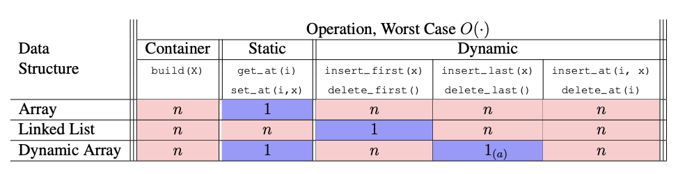

### 2.2 Set Interface

- Sequence about **extrinsic** order, set is about **intrinsic** order
- Maintain a set of items having **unique keys** (e.g., item x has key x.key) 
- Often we let key of an item be the item itself, but may want to store more info than just key
-  Special case interfaces
  - **dictionary** set without the Order operations 
- Storing items in an array in arbitrary order can implement a (not so efficient) set 
- Stored items sorted increasing by key allows:
  - faster find min/max (at first and last index of array)
  - faster finds via binary search: $O(\log n)$

##### Comparison Model 

- In this model, assume algorithm can only differentiate items via comparison 
- **Comparable items**: black boxes only supporting comparisons between pairs
- Comparisons are $<, \le, >, \ge, =, \ne$ , outputs are binary: True or False 
- **Goal**: Store a set of $n$ comparable items, support $\mathrm{find(k)}$ operation 
- Running time is **lower bounded** by # comparisons performed, so count comparisons! 

##### Decision Tree

- Any algorithm can be viewed as a decision tree of operations performed 
- An internal node represents a **binary comparison**, branching either True or False 
- For a comparison algorithm, the decision tree is binary. A leaf represents algorithm termination, resulting in an algorithm output. A root-to-leaf path represents an execution of the algorithm on some input 
- Need at least one leaf for each **algorithm output**, so search requires $\ge n + 1$ leaves (the 1 refers to $\mathrm{None}$)

#### 2.2.1 Sorting

- Given a sorted array, we can leverage binary search to make an efficient set data sructure
- **Input**: (static) array $A$ of n numbers 
- **Output**: (static) array $B$ which is a sorted permutation of $A$
  - **Permutation**: array with same elements in a different order 
  - **Sorted**: $B[i − 1] \le B[i]$ for all $i \in \{1, . . . , n\}$
- A sort is **destructive** if it overwrites $A$ (instead of making a new array $B$ that is a sorted version of $A$)
- A sort is **in place** if it uses $O(1)$ extra space (implies destructive: in place $\subseteq$ destructive) 

##### Permutation Sort

- There are $n!$ permutations of $A$, at least one of which is sorted
- For each permutation, check whether sorted in $\Theta(n)$
- Analysis:
  - try all possibilities 
  - Runnning time: $\Omega(n! \cdot n)$ which is **exponential**

##### Select Sort

- Find a largest number in prefix $A[:i + 1]$ and swap it to $A[i]$
- Recursively sort prefix $A[:i]$
- $\mathrm{prefix\_max}$ analysis:
  - Base case: for $i = 0$, array has one element, so index of max is $i$
  - Induction: assume correct for $i$, maximum is either the maximum of $A[:i]$ or $A[i]$, returns correct index in either case
  - $S(1)=\Theta(1),\ S(n)= S(n-1)+\Theta(1) \implies S(n) = \Theta(n)$
- $\mathrm{selection\_sort}$ analysis:
  - Base case: for $i = 0$, array has one element so is sorted
  - Induction: assume correct for $i$, last number of a sorted output is a largest number of the array, and the algorithm puts one there; then $A[:i]$ is sorted by induction
  - $T(1)=\Theta(1),\ T(n)= T(n-1)+S(n) = T(n-1)+\Theta(n) \implies T(n) = \Theta(n^2)$

##### Insertion Sort

- Recursively sort prefix $A[:i]$
- Sort prefix $A[:i + 1]$ assuming that prefix $A[:i]$ is sorted by repeated swaps 
- $\mathrm{insert\_last}$ analysis: 
  - Base case: for $i = 0$, array has one element so is sorted
  - Induction: assume correct for $i$, if $A[i] \ge A[i - 1]$, array is sorted; otherwise, swapping last two elements allows us to sort $A[:i]$ by induction 
  - $S(1)=\Theta(1),\ S(n)= S(n-1)+\Theta(1) \implies S(n) = \Theta(n)$
- $\mathrm{insertion\_sort}$ analysis: 
  - Base case: for $i = 0$, array has one element so is sorted 
  - Induction: assume correct for $i$, algorithm sorts $A[:i]$ by induction, and then $\mathrm{insert\_last}$ correctly sorts the rest as proved above 
  - $T(1)=\Theta(1),\ T(n)= T(n-1)+S(n) = T(n-1)+\Theta(n) \implies T(n) = \Theta(n^2)$

##### Merge Sort

- Recursively sort first half and second half (may assume power of two) 
- Merge sorted halves into one sorted list (two finger algorithm) 
- $\mathrm{merge}$ analysis:
  - Base case: for $n = 0$, arrays are empty, so vacuously correct
  - Induction: assume correct for $n$, item in $A[r]$ must be a largest number from remaining prefixes of $L$ and $R$, and since they are sorted, taking largest of last items suffices; remainder is merged by induction
  - $S(1)=\Theta(1),\ S(n)= S(n-1)+\Theta(1) \implies S(n) = \Theta(n)$
- $\mathrm{merge\_sort}$ analysis:
  - Base case: for $n = 1$, array has one element so is sorted
  - Induction: assume correct for $k < n$, algorithm sorts smaller halves by induction, and then $\mathrm{merge}$ merges into a sorted array as proved above. 
  - $T(1)=\Theta(1),\ T(n)= 2T(n/2)+\Theta(n) \implies T(n) = \Theta(n\log n)$

##### Linear Sorting

###### Comparison Sort Lower Bound

- To sort array of $n$ elements, # outputs is $n!$ permutations
- Thus height lower bounded by $\log(n!) \ge \log((n/2)^{n/2}) = \Omega(n \log n)$
- So merge sort is optinal in comparison model

###### Direct Access Array Sort

- Suppose all keys are **unique** non-negative integers in range ${0, . . . , u − 1}$, so $n \le u$
- Insert each item into a direct access array with size $u$ in $\Theta(n)$
- Return items in order they appear in direct access array in $\Theta(n)$
- Running time is $\Theta(n)$, which is $\Theta(n)$ if $u = \Theta(n)$
- What if keys are in larger range, like $u = \Omega(n^2) < n^2$?
- **Idea!** Represent each key $k$ by tuple $(a, b)$ where $k = an + b$ and $0 \le b < n$
- This is a built-in Python operation $(a, b) = \mathrm{divmod}(k, n)$
- **Example**: $[17, 3, 24, 22, 12] \implies [(3,2), (0,3), (4,4), (4,2), (2,2)] \implies [32, 03, 44, 42, 22]_{(n=5)}$
- How can we sort tuples?

###### Tuple Sort

- Item keys are tuples of equal length, i.e. item $x.key = (x.k_1, x.k_2, x.k_2, \dots)$
- Want to sort on all entries lexicographically, so first key $k_1$ is most significant 
- How to sort? **Idea!** Use other **auxiliary sorting algorithms** to separately sort each key (Like sorting rows in a spreadsheet by multiple columns) 
- What order to sort them in? Least significant to most significant! 
- Exercise: $[32, 03, 44, 42, 22] \implies [42, 22, 32, 03, 44] \implies [03, 22, 32, 42, 44]_{(n=5)}$
- **Idea!** Use tuple sort with **auxiliary direct access array sort** to sort tuples $(a, b)$
- **Problem!** Many integers could have the same $a$ or $b$ value, even if input keys distinct 
- Need sort allowing **repeated keys** which preserves input order 
- Want sort to be **stable**: repeated keys appear in output in same order as input 
- Direct access array sort cannot even sort arrays having repeated keys! 
- Can we modify direct access array sort to admit multiple keys in a way that is stable? 

###### Counting Sort

- Instead of storing a single item at each array index, store a chain, just like hashing! 
- For stability, chain data structure should remember the order in which items were added 
- Use a **sequence** data structure which maintains insertion order
- To insert item $x$, $\mathrm{insert\_last}$ to end of the chain at index $x.key$
- Then to sort, read through all chains in sequence order, returning items one by one

###### Radix Sort

- **Idea!** If $u < n^2$, use tuple sort with **auxiliary counting sort** to sort tuples (a, b)
- Sort least significant key $b$, then most significant key $a$
- Stability ensures previous sorts stay sorted 
- Running time for this algorithm is $O(2n) = O(n)$. Yay!
- If every key $< n^c$ for some positive $c = \log_n(u)$, every key has at most $c$ digits base $n$
- A $c$-digit number can be written as a $c$-element tuple in $O(c)$ time 
- We sort each of the $c$ base-$n$ digits in $O(n)$ time 
- So tuple sort with **auxiliary counting sort** runs in $O(cn)$ time in total 
- If c is constant, so each key is $\le n^c$ , this sort is linear $O(n)$! 

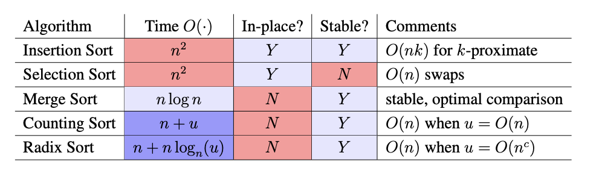

#### 2.2.2 Finding (Hashing)

- **Idea!** Want faster search and dynamic operations. Can we $\mathrm{find(k)}$ faster than $\Theta(\log n)$

##### Comparison Search Lower Bound

- What is worst-case running time of a comparison search algorithm? 
- running time $\ge$ # comparisons $\ge$ max length of any root-to-leaf path $\ge$ height of tree 
- Minimum height when binary tree is complete (all rows full except last) 
- Height $\ge [\lg(n + 1)] − 1 = Ω(\log n)$, so running time of any comparison sort is $\Omega(\log n)$
- Sorted arrays achieve this bound!
- More generally, height of tree with $\Theta(n)$ leaves and max branching factor b is $\Omega(\log_b n)$
- To get faster, need an operation that allows super-constant $\omega(1)$ branching factor

##### Direct Access Array

- Exploit Word-RAM $O(1$ time random access indexing! Linear branching factor! 
- **Idea!** Give item **unique** integer key k in ${0, \dots , u − 1}$, store item in an array at index $k$
- Associate a meaning with each index of array 
- If keys fit in a machine word, i.e. $u ≤ 2^w$, worst-case $O(1)$ find/dynamic operations! Yay! 
- But space O(u), so really bad if $n \ll u $. For example, if keys are ten-letter names, for one bit per name, requires 2610 $\approx$ 17.6 TB space 

##### Hasing

- **Idea!** If $n \ll u $, map keys to a smaller range $m = \Theta(n)$ and use smaller direct access array 
- **Hash function**: $h(k):\{0,\dots,u-1\}\rightarrow{\{0,\dots,m-1\}}$ (also hash map)
- Direct access array called **hash table**, $h(k)$ called the **hash** of key $k$
- If $m \ll u$, no hash function is injective by pigeonhole principle 
- Always exists keys $a, b$ such that $h(a) = h(b)$ → Collision! 
- Can't store both items at same index, so where to store? Either:
  - store somewhere else in the array (open addressing)
    - complicated analysis, but common and practical
  - tore in another data structure supporting dynamic set interface (chaining)

##### Chaining

- **Idea!** Store collisions in another data structure (a chain)
- If keys roughly evenly distributed over indices, chain size is $n/m=n/\Omega(n)=O(1)$
- If chain has $O(1)$ size, all operations take $O(1)$ time! Yay! 
- If not, many items may map to same location, e.g. $h(k) =$ constant, chain size is $\Theta(n)$
- Need good hash function! So what's a good hash function!

##### Hash Functions

###### **Division**(bad):     $h(k)=(k \mod m)$

- Heuristic, good when keys are uniformly distributed! 
- $m$ should avoid symmetries of the stored keys 
- Large primes far from powers of 2 and 10 can be reasonable 
- Python uses a version of this with some additional mixing 
- If $u \gg n$, every hash function will have some input set that will a create $ O(n)$ size chain. Attackers can use this to spam the hash table with collisions, tanking the speed to $\Theta(n)$ and crashing the system, which is called **Hash Denial of Service (DoS)** attack.
- **Idea!** Don’t use a fixed hash function! Choose one randomly (but carefully)! 

###### Universal (good, theoretically):    $h_{ab}(k)=(((ak+b)\mod p)\mod m)$

- Hash Family $\mathcal H(p,m)=\{h_{ab}|a,b\in\{0,\dots,p-1\ \mathrm{and} \ a \ne 0\}$

- Parameterized by a fixded prime $p > u$, with $a$ and $b$ chosen from range $\{0,\dots,p-1\}$

- $\mathcal H$ is a **Universal** family: $\underset{h\in\mathcal H}\Pr\{h(k_i) = h(k_j)\} ≤ 1/m \ \ \forall k_i \ne kj \in \{ 0, \dots , u − 1 \}$

- Why is universality useful? Implies short chain lengths! (in expectation) 

- $X_{ij}$ indicator random variable over $h \in \mathcal H: X_{ij} = 1 \ \ \mathrm{if} \  h(k_i) = h(k_j), \ X_{ij} = 0$ otherwise 

- Size of chain at index $h(k_i)$ is random variable $X_i = \sum_j X_{ij}$
  $$
  \begin{aligned}
  \underset{h\in\mathcal H} {\mathbb E}\{X_i\}=\underset{h\in\mathcal H} {\mathbb E} \left\{ \sum_j X_{ij} \right\} = \sum_j \underset{h\in\mathcal H} {\mathbb E}\{X_{ij}\} &= 1+\sum_{j \ne i} \underset{h\in\mathcal H} {\mathbb E}\{X_{ij}\} \\
  &= 1+\sum_{j \ne i}(1)\underset{h\in\mathcal H}\Pr\{h(k_i)=h(k_j)\} +(0)\underset{h\in\mathcal H}\Pr\{h(k_i) \ne h(k_j)\} \\
  &= 1+\sum_{j \ne i} 1/m = 1+(n-1)/m
  \end{aligned}
  $$

- Since $m=\Omega(n)$, load factor $\alpha=n/m=O(1)$, so $O(1)$ **in expectation!**

##### Dynamic

- If $n/m$ far from 1, rebuild with new randomly chosen hash function for new size $m$
- Same analysis as dynamic arrays, cost can be **amortized** over many dynamic operations 
- So a hash table can implement dynamic set operations in expected amortized $O(1)$ time! 

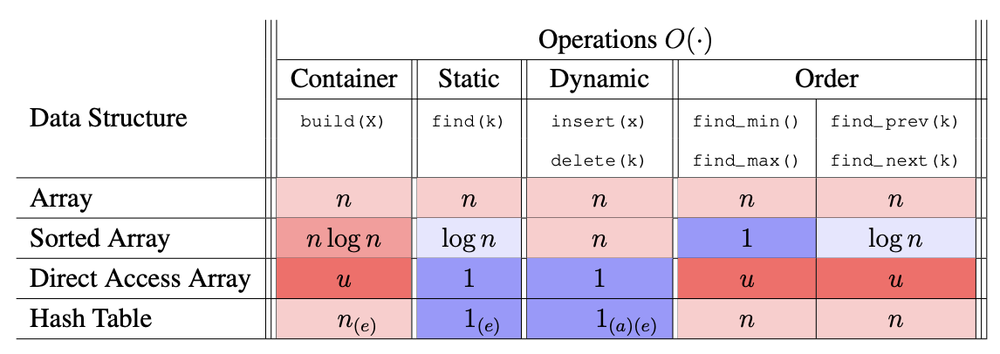

### 2.3 Binary Tree

- Pointer-based data structures (like Linked List) can achieve **worst-case** performance 
- Binary tree is pointer-based data structure with three pointers per node 
- Node representation: $\mathrm{node.\{item, parent, left, right\}}$
- **Examples: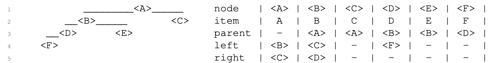**

#### Terminology

- The **root** of a tree has no parent (Ex: <A>) 
- A **leaf** of a tree has no children (Ex: <C>, <E>, and <F>)
- Define **depth**(<A>) of node <A> in a tree rooted at <R> to be length of path from <X> to <R>  
- **Idea:** Design operations to run in $O(h)$ time for root height $h$, and maintain $h = O(\log n)$
- A binary tree has an inherent order: its **traversal order** 
  - every node in node <X>’s left subtree is before <X>
  - every node in node <X>’s right subtree is after <X>
- List nodes in traversal order via a recursive algorithm starting at root:
  - Recursively list left subtree, list self, then recursively list right subtree 
  - Runs in $O(n)$ time, since $O(1)$ work is done to list each node 
  - Example: Traversal order is (<F>, <D>, <B>, <E>, <A>, <C>)

#### Tree Navigation 

- **Find first** node in the traversal order of node <X>’s subtree (last is symmetric)
  - If <X> has left child, recursively return the first node in the left subtree
  - Otherwise, <X> is the first node, so return it 
  - Running time is $O(h)$ where $h$ is the height of the tree 
  - Example: first node in <A>’s subtree is <F>
- **Find successor** of node  in the traversal order (predecessor is symmetric) 
  - If <X> has right child, return first of (the most left one) right subtree 
  - Otherwise, return lowest ancestor of <X> for which <X> is in its left subtree 
  - Running time is $O(h)$ where $h$ is the height of the tree
  - Example: Successor of:  <B> is <E>, <E> is <A>, and <C> is None

#### Dynamic Operations 

- Change the tree by a single item (only add or remove leaves): 
  - add a node after another in the traversal order (before is symmetric) 
  - remove an item from the tree 
- **Insert** node <Y> after node <X> in the traversal order 
  - If <X> has no right child, make <Y> the right child of <X>
  - Otherwise, make <Y> the left child of <X>’s successor (which cannot have a left child) 
  - Running time is $O(h)$ where h is the height of the tree
-  **Delete** the item in <X> from <X>'s subtree
  - If <X> is a leaf, detach from parent and return
  - Otherwise, <X> has a child 
    -  If <X> has a left child, swap items with the predecessor <X> and recurse
    - Otherwise <X> has a right child, swap items with the successor of <X> and recurse 
  - Running time is $O(h)$ where h is the height of the tree
  - Example: Remove <A> (not a leaf, so first swap down to a leaf)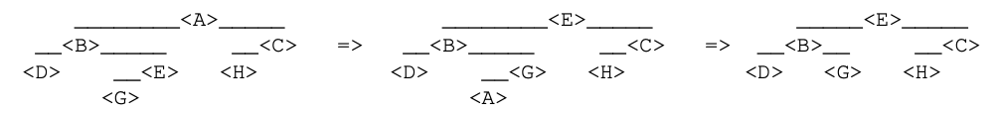

#### Application: Set 

- **Idea!** Set Binary Tree (a.k.a. **Binary Search Tree / BST**)
- Traversal order is sorted order increasing by key 
  - Equivalent to **BST Property**: for every node, every key in left subtree $\le$ node’s key $\le$ every key in right subtree 
- Then can find the node with key $k$ in node <X>’s subtree in $O(h)$ time like binary search: 
  - If $k$ is smaller than the key at <X> , recurse in left subtree (or return $\mathrm{None}$) 
  - If $k$ is larger than the key at <X> , recurse in right subtree (or return $\mathrm{None}$) 
  - Otherwise, return the item stored at <X>
- Other Set operations follow a similar pattern

#### Application: Sequence 

- **Idea!** **Sequence Binary Tree**: Traversal order is sequence order
- How do we find $i^{\mathrm{th}}$ node in traversal order of a subtree? Call this operation $\mathrm{subtree\_at(i)}$
- Could just iterate through entire traversal order, but that’s bad, $O(n)$
- However, if we could compute a subtree’s **size** in $O(1)$, then can solve in $O(h)$ time
  - How? Check the size $n_L$ of the left subtree and compare to $i$
  - If $i < n_L$, recurse on the left subtree 
  - If $i > n_L$, recurse on the right subtree with $i' = i- n_L - 1$
  - Otherwise, $i = n_L$, and you’ve reached the desired node! 
- Maintain the size of each node’s subtree at the node via **augmentation** 
  - Add $\mathrm{node.size}$ field to each $\mathrm{node}$
  - When adding new leaf, add $+1$ to $\mathrm{a.size}$ for all ancestors a in $O(h)$ time
  - When deleting a leaf, add $−1$ to $\mathrm{a.size}$ for all ancestors a in $O(h)$ time 
- Sequence operations follow directly from a fast $\mathrm{subtree\_at(i)}$ operation 
- Naively, $\mathrm{build(X)}$ takes $O(nh)$ time, but can be done in $O(n)$ time

#### Height Balance

- How to maintain height $h=O(\log n)$ where $n$ is number of nodes in tree?
- A binary tree that maintains $O(\log n)$ height under dynamic operations is called **balanced** 
  - There are many balancing schemes (Red-Black Trees, Splay Trees, 2-3 Trees, . . . )
  - First proposed balancing scheme was the **AVL Tree** (Adelson-Velsky and Landis, 1962)

##### Rotations

- Need to reduce height of tree without changing its traversal order, so that we represent the same sequence of items
- How to change the structure of a tree, while preserving traversal order? **Rotations!** 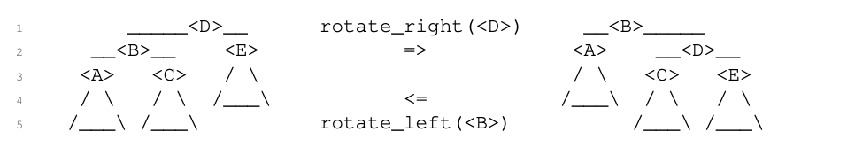
- A rotation relinks $O(1)$ pointers to modify tree structure and maintains traversal order

##### Rotations Suffice

- **Claim**: $O(n)$ rotation can transform a binary tree to any other with same traversal order
- **Proof**: Repeatedly perform last possible right rotation in traversal order; resulting tree is a canonical chain. Each rotation increases depth of the last node by $1$. Depth of last node in final chain is $n − 1$, so at most $n − 1$ rotations are performed. Reverse canonical rotations to reach target tree. 
- Can maintain height-balance by using $O(n)$ rotations to fully balance the tree, but slow
- We will keep the tree balanced in $O(\log n)$ time per operation! 

##### AVL Trees: Height Balance

- AVL trees maintain **height-balance** (also called the **AVL Property**)
  - A node is **height-balanced** if heights of its left and right subtrees differ by at most $1$
  - Let **skew** of a node be the height of its right subtree minus that of its left subtree 
  - Then a node is height-balanced if its skew is $−1$, $0$, or $1$
- **Claim**: A binary tree with height-balanced nodes has height $h = O(\log n)$ (i.e., $n = 2^{\Omega(h)}$ )
- **Proof**: Suffices to show fewest nodes $F(h)$ in any height h tree is $F(h) = 2^{\Omega(h)}$
  - $F(0)=1, F(1)=2, F(h)=1+F(h-1)+F(h-2)\ge 2F(h-2)\implies F(h) \ge 2^{h/2}$
- Suppose adding or removing leaf from a height-balanced tree results in imbalance 
  - Only subtrees of the leaf’s ancestors have changed in height or skew
  - Heights changed by only $\pm 1$, so skews still have magnitude $ \le 2$
  - **Idea**: Fix height-balance of ancestors starting from leaf up to the root 
  - Repeatedly rebalance lowest ancestor that is not height-balanced, wlog (**W**ithout **L**oss **O**f **G**enerality) assume skew $2$
- **Local Rebalance**: Given binary tree node <B>:
  - whose skew $2$ and  
  - every other node in <B>’s subtree is height-balanced,
  - then <B>’s subtree can be made height-balanced via one or two rotations
  - (after which <B>’s height is the same or one less than before)
- **Proof**:
  - Since skew of <B> is 2, <B>’s right child <F> exists
  - **Case 1**: skew of <F> is $0$ or **Case 2**: skew of  is $1$
    - perform a left rotation on <B>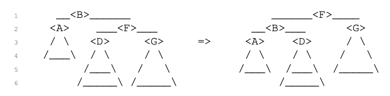
  - **Case 3**: skew of <F> is −1, so the left child <D> of <F> exists 
    - Perform a right rotation on <F>, then a left rotation on <B>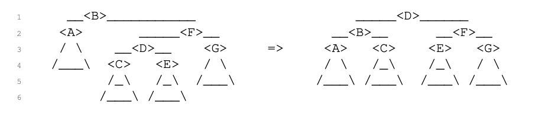

##### Computing Height 

- How to tell whether node  is height-balanced? Compute heights of subtrees! 
- **Idea**: Augment each node with the height of its subtree! (Save for later!) 
- Height of <X> can be computed in $O(1)$ time from the heights of its children: 
  - Look up the stored heights of left and right subtrees in $O(1)$ time
  - Add $1$ to the max of the two heights
- During dynamic operations, we must **maintain** our augmentation as the tree changes shape
- Recompute subtree augmentations at every node whose subtree changes:
  - Update relinked nodes in a rotation operation in $O(1)$ time (ancestors don’t change)
  - Update all ancestors of an inserted or deleted node in $O(h)$ time by walking up the tree 

##### Steps to Augment a Binary Tree 

- In general, to augment a binary tree with a **subtree property** $P$, you must: 
  - State the subtree property $P($<X>$)$ you want to store at each node <X>
  - Show how to compute $P($<X>$)$ from the augmentations of <X>’s children in $O(1)$ time
- Then stored property $P($<X>$)$ can be maintained without changing dynamic operation costs 

### 2.4 Binary Heaps

#### 2.4.1 Priority Queue Interface

- Keep track of many items, quickly access/remove the most important 
  - Example: process scheduling in operating system kernels 
- Order items by key = priority so **Set interface** (not Sequence interface)
- Optimized for a particular subset of Set operations: 
  - $\mathrm{build(X)}$: build priority queue from iterable $\mathrm{X}$
  - $\mathrm{insert(X)}$: add item $\mathrm{x}$ to data structure
  - $\mathrm{delete\_max(X)}$: remove and return stored item with largest key
  - $\mathrm{find\_max(X)}$: return stored item with largest key
- (Usually optimized for max or min, not both) 
- Focus on $\mathrm{insert}$ and $\mathrm{delete\_max}$ operations: $\mathrm{build}$ can repeatedly $\mathrm{insert}$; $\mathrm{find\_max()}$ can $\mathrm{insert(delete\_max())}$ 

#### 2.4.2 Priority Queue Sort

-  Any priority queue data structure translates into a sorting algorithm: 
  - $\mathrm{build(A)}$, e.g., $\mathrm{insert}$ items one by one in input order 
  - Repeatedly $\mathrm{delete\_min()}$ (or $\mathrm{delete\_max()}$) to determine (reverse) sorted order 
- All the hard work happens inside the data structure 
- Running time is $T_{\mathrm{build}} + n \cdot T_{\mathrm{delete\_max}} \le n \cdot T_{\mathrm{insert}} + n \cdot T_{\mathrm{delete\_max}}$

##### Priority Queue: Set AVL Tree

- Set AVL trees supports $\mathrm{insert()}$, $\mathrm{find\_min()}$, $\mathrm{find\_max()}$, $\mathrm{delete\_min()}$, $\mathrm{delete\_max()}$ in $O(\log n)$ time per operation
- So priority queue sort runs in $O(n \log n)$ time 
- Can speed up $\mathrm{find\_min()}$ and $\mathrm{find\_max()}$ to $O(1)$ time via subtree augmentation 
- But this data structure is complicated and resulting sort is not **in-place**

##### Priority Queue: Array

- Store elements in an **unordered** dynamic array 
- $\mathrm{insert(x)}$: append $x$ to end in amortized $O(1)$ time
- $\mathrm{delete\_max()}$: find max in $O(n)$, swap max to the end and remove 
- $\mathrm{insert}$ is quick, but $\mathrm{delete\_max}$ is slow 
- Priority queue sort is **selection sort**!

##### Priority Queue: Sorted Array

- Store elements in a **sorted** dynamic array
- $\mathrm{insert(x)}$: append $x$ to end, swap down to sorted position in $O(n)$ time
- $\mathrm{delete\_max()}$: delete from end in $O(1)$ amortized  
- $\mathrm{delete\_max}$is quick, but $\mathrm{insert}$ is slow 
- Priority queue sort is **insertion sort**!

##### Array as a Complete Binary Tree

- **Idea:** interpret an array as a complete binary tree, with maximum $2^i$ nodes at depth $i$ except at the largest depth, where all nodes are **left-aligned**
- Equivalently, complete tree is filled densely in reading order: root to leaves, left to right
- Perspective: **bijection** between arrays and complete binary trees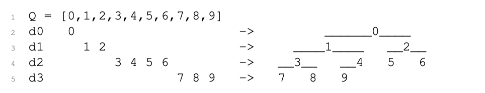
- Height of complete tree perspective of array of $n$ item is $[\lg n]$, so **balanced** binary tree 

##### Implicit Complete Tree 

- Complete binary tree structure can be **implicit** instead of storing pointers
- Root is at index $0$
- Compute neighbors by index arithmetic: 
  - $\mathrm{left}(i) = 2i+1$
  - $\mathrm{right}(i) = 2i+2$
  - $\mathrm{parent}(i)=[(i-1)/2]$

#### 2.4.3 Binary Heaps

- **Idea**: keep larger elements higher in tree, but only locally 
- **Max-Heap Property** at node $ i: Q[i] \ge Q[j]$ for $j \in \{\mathrm{left}(i),\mathrm{right}(i)\}$
- **Max-heap** is an array satisfying max-heap property at all nodes
- **Claim**: In a max-heap, every node i satisfies $Q[i] \ge Q[j]$ for **all nodes** $j$ in $\mathrm{subtree}(i)$
-  In particular, max item is at root of max-heap 

##### Heap Insert

- Append new item x to end of array in $O(1)$ amortized, making it next leaf $i$ in reading order 
- $\mathrm{max\_heapify\_up}(i)$: swap with parent until Max-Heap Property 
  - Check whether $Q[\mathrm{parent}(i)] \ge Q[i]$ (part of Max-Heap Property at $\mathrm{parent}(i)$) 
  - If not, swap items $Q[i]$ and $Q[\mathrm{parent}(i)]$, and recursively $\mathrm{max\_heapify\_up}(\mathrm{parent}(i))$

- Running time: height of tree, so $\Theta(\log n)$! 

##### Heap Delete Max

- Can only easily remove last element from dynamic array, but max key is in root of tree 
- So swap item at root node $i = 0$ with last item at node $n − 1$ in heap array 
- $\mathrm{max\_heapify\_down}(i)$: swap with parent until Max-Heap Property 
  - Check whether $Q[i] \ge Q[j]$ for $j \in \{\mathrm{left}(i),\mathrm{right}(i)\}$ (Max-Heap Property at $i$) 
  - If not, swap items $Q[i]$ with $Q[j]$ for child $j \in \{\mathrm{left}(i),\mathrm{right}(i)\}$ with maximum key, and recursively $\mathrm{max\_heapify\_down}(j)$
-  Running time: height of tree, so $\Theta(\log n)$! 

#### Heap Sort 

- Plugging max-heap into priority queue sort gives us a new sorting algorithm
- Running time is $O(n \log n)$ because each $\mathrm{insert}$ and $\mathrm{delete\_max}$ takes $O(\log n)$
- But often include two improvements to this sorting algorithm: 

##### In-place Priority Queue Sort

- Max-heap $Q$ is a prefix of a larger array $A$, remember how many items $|Q|$ belong to heap
- $|Q|$ is initially zero, eventually $|A|$ (after inserts), then zero again (after deletes) 
- $\mathrm{insert()}$ absorbs next item in array at index $|Q|$ into heap
- $\mathrm{delete\_max()}$ moves max item to end, then abandons it by decrementing $|Q|$
- In-place priority queue sort with Array is exactly Selection Sort
- In-place priority queue sort with Sorted Array is exactly Insertion Sort
- In-place priority queue sort with binary Max Heap is **Heap Sort**

##### Linear Build Heap

- Inserting $n$ items into heap calls $\mathrm{max\_heapify\_up}(i)$ for $i$ from $0$ to $n − 1$ (root down): 

$$
\mathrm{worst\_case swaps} \approx \sum_{i=0}^{n-1} \mathrm{depth}(i) = \sum_{i=0}^{n-1} \lg i = \lg(n!) \ge (n/2)\lg(n/2) = \Omega(n \lg n)
$$

- **Idea!** Treat full array as a complete binary tree from start, then $\mathrm{max\_heapify\_down}(i)$ for $i$ from $n − 1$ to $0$ (leaves up): 

$$
\mathrm{worst\_case swaps} \approx \sum_{i=0}^{n-1} \mathrm{height}(i) = \sum_{i=0}^{n-1} (\lg n-\lg i) = \lg(\frac{n^n}{n!}) = \Theta (\lg \frac{n^n}{\sqrt{n}(n/e)^n}) = O(n)
$$

-  So can $\mathrm{build}$ heap in $O(n)$ time 
- (Doesn’t speed up $O(n \lg n)$ performance of heap sort) 

## 3. Graph Theory

### 3.1 Breadth-First Search (BFS)

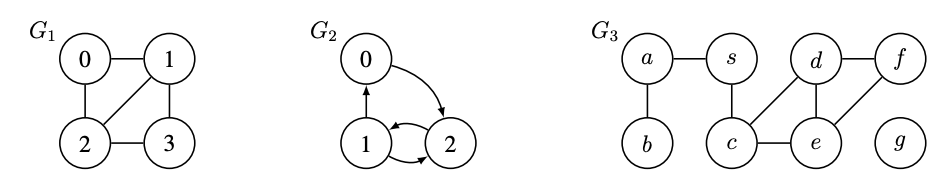

#### 3.1.1 Graph Definitions

- Graph $G = (V, E)$ is a set of vertices $V$ and a set of pairs of vertices $E \subseteq V × V$ . 
- **Directed** edges are ordered pairs, e.g., $(u,v) \in V$
- **Undirected** edges are unordered pairs, e.g., $\set{u, v}$ for $u, v \in V$ i.e., $(u, v)$ and $(v, u)$
- In this class, we assume all graphs are **simple**: 
  - edges are **distinct**, e.g., $(u, v)$ only occurs once in $E$ (though $(v, u)$ may appear), and 
  - edges are **pairs of distinct vertices**, e.g., $u \ne v$ for all $(u, v) \in E$
  - Simple implies $|E| = O(|V|^2)$, since $|E|\le C_{|V|}^2$ for undirected, $\le 2C_{|V|}^2$ for directed 

#### 3.1.2 Neighbor Sets/Adjacencices

- The **outgoing neighbor set** of $u \in V$ is $\mathrm{Adj}^+(u) = \set{v \in V | (u, v) \in E}$
- The **incoming neighbor set** of $u \in V$ is $\mathrm{Adj}^-(u) = \set{v \in V | (u, v) \in E}$
- The **out-degree** of a vertex $u \in V$ is $\mathrm{deg}^+(u) = |\mathrm{Adj}^+(u)|$
- The **in-degree** of a vertex $u \in V$ is $\mathrm{deg}^-(u) = |\mathrm{Adj}^-(u)|$
- For undirected graphs, $\mathrm{Adj}^+(u) = \mathrm{Adj}^-(u)$ and $\mathrm{deg}^+(u) = \mathrm{deg}^-(u)$
- Dropping superscript defaults to outgoing, i.e., $\mathrm{Adj}(u) = \mathrm{Adj}^+(u)$ and $\mathrm{deg}(u) = \mathrm{deg}^+(u)$

#### 3.1.3 Graph Representations 

- To store a graph $G = (V, E)$, we need to store the outgoing edges $\mathrm{Adj}(u)$ for all $u \in V$
- First, need a Set data structure $\mathrm{Adj}$ to map $u$ to $\mathrm{Adj}(u)$
- Then for each $u$, need to store $\mathrm{Adj}(u)$ in another data structure called an **adjacency list**
- Common to use direct access array or hash table for $\mathrm{Adj}$, since want lookup fast by vertex 
- Common to use array or linked list for each $\mathrm{Adj}(u)$ since usually only iteration is needed 
- For the common representations, $\mathrm{Adj}$ has size $\Theta(|V|)$, while each $\mathrm{Adj}(u)$ has size $\Theta(\deg(u))$
- Since $u \in V \deg(u) \le 2|E|$ by handshaking lemma, graph storable in $\Theta(|V| + |E|)$ space 
- Thus, for algorithms on graphs, linear time will mean $\Theta(|V | + |E|) $(linear in size of graph) 

#### 3.1.4 Paths

- A path is a sequence of vertices $p = (v_1, v_2, \dots , v_k)$ where $(v_i, v_{i+1}) \in E$  for all $1 \le i < k$.
- A path is **simple** if it does not repeat vertices
- The length $\mathcal l(p)$ of a path p is the number of edges in the path 
- The distance $\delta(u,v)$ from $u \in V$ to $v \in V$ is the minimum length of any path from $u$ to $v$, i.e., the length of a **shortest path** from $u$ to $v$

#### 3.1.5 Graph Path Problems

- There are many problems you might want to solve concerning paths in a graph: 
  - $\mathrm{Single\_Pair\_Reachability}(G,s,t)$: is there a path in $G$ form $s \in V$ to $t \in V$?
  - $\mathrm{Single\_Pair\_Shortest\_Path}(G,s,t)$: return distance $\delta(s,t)$, and a shortest path in $G=(V,E)$ from $s \in V$ to $t \in V$
  - $\mathrm{Single\_Source\_Shortest\_Paths}(G,s)$: return $\delta(s,v)$ for all $v \in V$, and **a shortest-path tree** containing a shortest path form $s$ to every $v \in V$
- Each problem above is at least as hard as every problem above it
- We won't show algorithms to solve all of these problems
- Instead, show one algorithm that solves the hardest in $O(|V|+|E|)$ time!

#### 3.1.6 Shortest Paths Tree

- How to return a shortest path from source vertex s for every vertex in graph? 
- Many paths could have length $\Omega(|V|)$, so returning every path could require $\Omega(|V|^2)$ time 
- Instead, for all $v \in V$ , store its parent $P(v)$: second to last vertex on a shortest path from $s$
- Let $P(s)$ be null (no second to last vertex on shortest path from $s$ to $s$)
- Set of parents comprise a shortest paths tree with $O(|V|)$ size!

#### 3.1.7 Breadth-First Search (BFS)

- How to compute $\delta(s, v)$ and $P(v)$ for all $v \in V$ ? 
- Store $\delta(s, v)$ and $P(v)$ in Set data structures mapping vertices $v$ to distance and parent 
- (If no path form $s$ to $v$, do not store $v$ in $P$ and set $\delta(s, v)$ to $\infin$)
- **Idea!** Explore graph nodes in increasing order of distance
- **Goal**: Compute **level sets** $L_i = \set{v| v \in V \ \mathrm{and}\  \delta(s, v) = i}$ (i.e., all vertices at distance $i$) 
- Claim: Every vertex $v \in L_i$ must be adjacent to a vertex $u \in L_{i−1}$ (i.e., $v \in \mathrm{Adj}(u)$)
- Claim: No vertex that is in $L_j$ for some $j < i$, appears in $L$
- **Invariant**: $\delta(s, v)$ and $P(v)$ have been computed correctly for all $v$ in any $L_j$ for $j < i$
  - Base case ($i = 1$): $L_0 = \set{s}$, $\delta(s, s) = 0$, $P(s) = \mathrm{None}$
  - Inductive Step: To compute $L_i$
    - for every vertex $u$ in $L_{i−1}$:
      - for every vertex $v \in \mathrm{Adj}(u)$ that does not appear in any $L_j$ for $j < i$: 
        - add $v$ to $L_i$, set $\delta(s, v) = i$, and set $P(v) = u$
  - Repeatedly compute $L_i$ from $L_j$ for $j < i$ for increasing $i$ until $L_i$ is the empty set
  - Set $\delta(s, v) = \infin$ for any $v \in V$ for which $\delta(s, v)$ was not set
- Running time analysis:
  - Algorithm adds each vertex $u$ to $\le 1$ level and spends $O(1)$ time for each $v \in \mathrm{Adj}(u)$
  - Work upper bounded by $O(1) × \sum_{u\in V}\deg(u) = O(|E|)$ by handshake lemma 
  - Spend $\Theta(|V|)$ at end to assign $\delta(s, v)$ for vertices $v \in V$ not reachable from $s$
  - So breadth-first search runs in linear time! $O(|V| + |E|)$

### 3.2 Depth-First Search (DFS)

- Graph Path Problems

  - $\mathrm{Single\_Pair\_Reachability}(G,s,t)$

  - $\mathrm{Single\_Source\_Reachability}(G,s)$

  - $\mathrm{Single\_Pair\_Shortest\_Path}(G,s,t)$

  - $\mathrm{Single\_Source\_Shortest\_Paths}(G,s)$ (SSSP)

- Searches a graph from a vertex $s$, similar to BFS
- Solves Single Source Reachability, **not** SSSP. Useful for solving other problems
- Return (not neccessarily shortest) parent tree of parent pointers back to $s$
- **Idea!** Visit outgoing adjacencies recursively, but never revisit a vertex
- i.e., follow any path until you get stuck, backtrack until finding an unexplored path to explore
- $P(s)=\mathrm{None}$, then run $\mathrm{visit(s)}$, where
- $\mathrm{visit(s)}$:
  - for every $v \in \mathrm{Adj(u)}$ that does not appear in $P$:
    - set $P(v)=u$ and recursively call $\mathrm{visit(v)}$
  - (DFS finishes visiting vertex $u$, for use later!)

#### 3.2.1 Corrextness

- Claim: DFS visits $v$ and correctly sets $P(v)$ for every vertex $v$ reachable form $s$
- Proof: induct on $k$, for claim on only vertices within distance $k$ from $s$
  - Base case ($k = 0$): $P(s)$ is set correctly for $s$ and $s$ is visited
  - Inductive step: Consider vertex $v$ with $\delta(s,v)=k'+1$
  - Consider vertex $u$, the second to last vertex on some shortest path from $s$ to $v$
  - By induction, since $\delta(s,u) = k'$ , DFS visits $u$ and sets $P(u)$ correctly 
  - While visiting $u$, DFS considers $v \in \mathrm{Adj(u)}$
  - Either $v$ is in $P$, so has already been visited, or $v$ will be visited while visiting $u$
  - In either case, $v$ will be visited by DFS and will be added correctly to $P$

#### 3.2.2 Running Time

- Algorithm visits each vertex $u$ at most once and spends $O(1)$ time for each $v \in \mathrm{Adj}(u)$
- Work upper bounded by $O(1) \times \sum_{u \in V}deg(u) = O(|E|)$
- Unlike BFS, not returning a distance for each vertex, so DFS runs in $O(|E|)$ time

#### 3.2.3 Full-BFS and Full-DFS

- Suppose want to explore entire graph, not just vertices reachable from one vertex 
- **Idea!** Repeat a graph search algorithm $A$ on any unvisited vertex 
- Repeat the following until all vertices have been visited: 
  - Choose an arbitrary unvisited vertex $s$, use $A$ to explore all vertices reachable from $s$

- We call this algorithm **Full-A**, specifically Full-BFS or Full-DFS if $A$ is BFS or DFS
- Visits every vertex once, so both Full-BFS and Full-DFS run in $O(|V | + |E|)$ time 

#### 3.2.4 Graph Connectivity

- An **undirected** graph is **connected** if there is a path connecting every pair of vertices 
- In a directed graph, vertex $u$ may be reachable from $v$, but $v$ may not be reachable from $u$
- Connectivity is more complicated for directed graphs (we won’t discuss in this class) 
- $\mathrm{Connectivity}(G)$ is undirected graph $G$ connected?
- $\mathrm{Connected\ Components}(G)$: given undirected graph $G = (V, E)$, return partition of $V$ into subsets $V_i \subseteq V$ (connected components) where each $V_i$ is connected in $G$ and there are no edges between vertices from different connected components 
- Consider a graph algorithm $A$ that solves Single Source Reachability 
- **Claim**: $A$ can be used to solve Connected Components 
- **Proof**: Run Full-A. For each run of $A$, put visited vertices in a connected component

#### 3.2.5 Topological Sort 

- A **Directed Acyclic Graph** (DAG) is a directed graph that contains no directed cycle
- A Topological Order of a graph $G = (V, E)$ is an ordering $f$ on the vertices such that: every edge $(u, v) \in E$ satisfies $f(u) < f(v)$
- A **Finishing Order** is the order in which a Full-DFS **finishes visiting** each vertex in $G$
- **Claim**: If $G = (V, E)$ is a DAG, the reverse of a finishing order is a topological order
  - Proof: Need to prove, for every edge $(u, v) \in E$ that $u$ is ordered before $v$, i.e., the visit to $v$ finishes before visiting $u$. Two cases: 
    - If $u$ visited before $v$:
      - Before visit to $u$ finishes, will visit $v$ (via $(u, v)$ or otherwise) 
      - Thus the visit to $v$ finishes before visiting $u$
    - If $v$ visited before $u$: 
      - $u$ can’t be reached from $v$ since graph is acyclic 
      - Thus the visit to $v$ finishes before visiting $u$

#### 3.2.6 Cycle Detection

- Full-DFS will find a topological order if a graph $G = (V, E)$ is acyclic
- If reverse finishing order for Full-DFS is not a topological order, then $G$ must contain a cycle 
- Check if $G$ is acyclic: for each edge $(u, v)$, check if $v$ is before $u$ in reverse finishing order 
- Can be done in $O(|E|)$ time via a hash table or direct access array 
- To return such a cycle, maintain the set of **ancestors** along the path back to $s$ in Full-DFS 
- **Claim**: If $G$ contains a cycle, Full-DFS will traverse an edge from $v$ to an ancestor of $v$
- **Proof**: Consider a cycle $(v_0, v_1, \dots , v_k, v_0)$ in $G$
  - Without loss of generality, let $v_0$ be the first vertex visited by Full-DFS on the cycle 
  - For each $v_i$, before visit to $v_i$ finishes, will visit $v_{i+1}$ and finish 
  - Will consider edge $(v_i, v_{i+1})$, and if $v_{i+1}$ has not been visited, it will be visited now 
  - Thus, before visit to $v_0$ finishes, will visit $v_k$ (for the first time, by $v_0$ assumption) 
  - So, before visit to $v_k$ finishes, will consider $(v_k, v_0)$, where $v_0$ is an ancestor of $v_k$

### 3.3 Weighted Shortest Paths

#### 3.3.1 Weighted Graphs

- A **weighted graph** is a graph $G=(V,E)$ together with a weight function $w:E \rightarrow \mathbb{Z}$
- Many applications for edge weights in a graph:
  - distance in road network
  - latency in network connections
  - strength of a relationship in a social network
- Two common ways to respresent weights computationally: 
  - Inside graph representation: store edge weight with each vertex in adjacency lists 
  - Store separate Set data structure mapping each edge to its weight 
- We assume a representation that allows querying the weight of an edge in $O(1)$ time 

#### 3.3.2 Weighted Paths

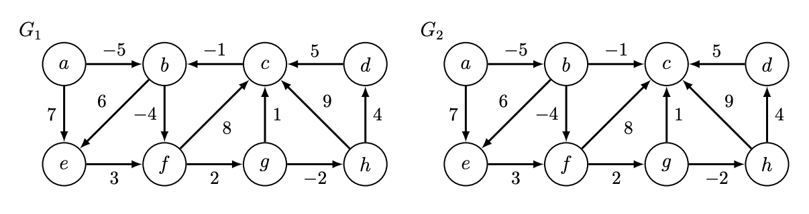

- The **weight** $w(\pi)$ of a path $\pi$ in a weighted graph is the sum of weights of edges in the path
- The (weighted) shortest path from $s \in V$ to $t \in V$ is path of minimum weight from $s$ to $t$
- $\delta(s,t) = \inf \{ w(\pi) | \mathrm{path}\  \pi \  \mathrm{from} \ s\  \mathrm{to}\  t \} $ is the **shortest-path weight** from $s$ to $t$
- (Often use “distance” for shortest-path weight in weighted graphs, not number of edges) 
- As with unweighted graphs: 
  - $\delta(s,t) = \infin$ if no path from $s$ to $t$
  - Subpaths of shortest paths are shortest paths (or else could splice in a shorter path) 
- Why infimum not minimum? Possible that no finite-length minimum-weight path exists 
- When? Can occur if there is a negative-weight cycle in the graph, Ex: $(b, f, g, c, b)$ in $G_1$
- A **negative-weight** cycle is a path $\pi$ starting and ending at same vertex with $w(\pi) < 0$
- $\delta(s,t) = −\infin$ if there is a path from s to t through a vertex on a negative-weight cycle 
- If this occurs, don’t want a shortest path, but may want the negative-weight cycle 

#### 3.3.3 Weighted Shortest Paths Algorithms

- Already know one algorithm: Breadth-First Search! Runs in $O(|V|+|E|)$ time when,
  - graph has positive weights, and all weights are the same 
  - graph has positive weights, and sum of all weights at most $O(|V | + |E|)$
- For general weighted graphs, we don’t know how to solve SSSP in $O(|V | + |E|)$ time 
- But if your graph is a **Directed Acyclic Graph** you can! 

#### 3.3.4 Shortest-Paths Tree

- For BFS, we kept track of parent pointers during search. Alternatively, compute them after! 
- If know $\delta(s, v)$ for all vertices $v \in V$, can construct shortest-path tree in $O(|V | + |E|)$ time 
- For weighted shortest paths from $s$, only need parent pointers for vertices $v$ with finite $\delta(s, v)$
- Initialize empty $P$ and set $P(s) = \mathrm{None}$
- For each vertex $u \in V$ where $\delta(s, v)$ is finite: 
  - For each outgoing neighbor $v \in \mathrm{Adj}^+(u)$: 
    - If $P(v)$ not assigned and $\delta(s, v) = \delta(s, u) + w(u, v)$: 
    - There exists a shortest path through edge $(u, v)$, so set $P(v) = u$
- Parent pointers may traverse cycles of zero weight. Mark each vertex in such a cycle
- For each unmarked vertex $u \in V$ (including vertices later unmarked): 
  - For each $v \in \mathrm{Adj}^+(u)$ where v is marked and $\delta(s, v) = \delta(s, u) + w(u, v)$: 
    - Unmark vertices in cycle containing $v$ by traversing parent pointers from $v$
    - Set $P(v) = u$, breaking the cycle 

#### 3.3.5 DAG Relaxation

- **Idea!** Maintain a distance estimate $d(s, v)$ (initially $\infin$) for each vertex $v \in V$ , that always upper bounds true distance $\delta(s, v)$, then gradually lowers until $d(s, v) = \delta(s, v)$
- When do we lower? When an edge violates the triangle inequality! 
- **Triangle Inequality**: the shortest-path weight from $u$ to $v$ cannot be greater than the shortest path from $u$ to $v$ through another vertex $x$, i.e., $\delta(u, v) \le \delta(u, x) + \delta(x, v)$ for all $u, v, x \in V$
- If $d(s, v) > d(s, u) + w(u, v)$ for some edge $(u, v)$, then triangle inequality is violated 
- Fix by lowering $d(s, v)$ to $d(s, u) + w(u, v)$, i.e., relax $(u, v)$ to satisfy violated constraint 
- **Claim**: Relaxation is safe: maintains that each $d(s, v)$ is weight of a path to v (or $\infin$) $\forall v \in V$
- **Proof**: Assume $d(s, v_0)$ is weight of a path (or $\infin$) for all $v_0 \in V$. Relaxing some edge $(u, v)$ sets $d(s, v)$ to $d(s, u) + w(u, v)$, which is the weight of a path from $s$ to $v$ through $u$
- Set $d(s, v) = \infin$ for all $v \in V$ , then set $d(s, s) = 0$
- Process each vertex $u$ in a topological sort order of $G$: 
  - For each outgoing neighbor $v \in \mathrm{Adj}^+(u)$: 
    - If $d(s, v) > d(s, u) + w(u, v)$: 
      - relax edge $(u, v)$, i.e., set $d(s, v) = d(s, u) + w(u, v)$

#### 3.3.6 Correctness

- **Claim**: At end of DAG Relaxation: $d(s, v) = \delta(s, v)$ for all $v \in V$
- **Proof**: Induct on $k: d(s, v) = \delta(s, v)$ for all $v$ in first $k$ vertices in topological order
  - Base case: Vertex $s$ and every vertex before $s$ in topological order satisfies claim at start  
  - Inductive step: Assume claim holds for first $k'$ vertices, let v be the $(k' + 1)^{\mathrm{th}} $
  - Consider a shortest path from $s$ to $v$, and let $u$ be the vertex preceding $v$ on path 
  - $u$ occurs before $v$ in topological order, so $d(s, u) = \delta(s, u)$ by induction 
  - When processing $u$, $d(s, v)$ is set to be no larger ($\le$) than $\delta(s, u) + w(u, v) = \delta(s, v)$
  - But $d(s, v) \ge \delta(s, v)$, since relaxation is safe, so $d(s, v) = \delta(s, v)$
- Alternatively: 
  - For any vertex $v$, DAG relaxation sets $d(s, v) = \min\{d(s, u)+w(u, v) | u \in \mathrm{Adj}^−(v)\}$
  - Shortest path to $v$ must pass through some incoming neighbor $u$ of $v$
  - So if $d(s, u) = \delta(s, u)$ for all $u \in \mathrm{Adj}^−(v)$ by induction, then $d(s, v) = \delta(s, v)$

#### 3.3.7 Running Time

- Initialization takes $O(|V |)$ time, and Topological Sort takes $O(|V | + |E|)$ time 
- Additional work upper bounded by $O(1) \times \sum_{u \in V} \mathrm{deg}^+(u) = O(|E|)$
- Total running time is linear, $O(|V | + |E|)$

### 3.4 Bellman-Ford

#### 3.4.1 Simple Shortest Paths

- If graph contains cycles and negative weights, might contain negative-weight cycles 
- If graph does not contain negative-weight cycles, shortest paths are simple! 
- **Claim 1**: If $\delta(s, v)$ is finite, there exists a shortest path to $v$ that is simple
- **Proof**: By contradiction:
  - Suppose no simple shortest path; let $\pi$ be a shortest path with fewest vertices 
  - $\pi$ not simple, so exists cycle $C$ in $\pi$; $C$ has non-negative weight (or else $\delta(s, v) = −\infin$) 
  - Removing $C$ from $\pi$ forms path $\pi_0$ with fewer vertices and weight $w(\pi_0 ) \le w(\pi)$
- Since simple paths cannot repeat vertices, finite shortest paths contain at most $|V | − 1$ edges 

#### 3.4.2 Negative Cycle Witness

- **k-Edge Distance** $\delta_k(s, v)$: the minimum weight of any path from $s$ to $v$ using $\le k$ edges 
- **Idea!** Compute $\delta_{|V |−1}(s, v)$ and $\delta_{|V|}(s, v)$ for all $v \in V$
  - If $\delta(s, v) \ne −\infin$, $\delta(s, v) = \delta_{|V|−1}(s, v)$, since a shortest path is simple (or nonexistent) 
  - If $\delta_{|V|}(s, v) < \delta_{|V|−1}(s, v)$
    - there exists a shorter non-simple path to $v$, so $\delta_{|V|}(s, v) = −\infin$
    - call $v$ a (negative cycle) witness
  - However, there may be vertices with $−\infin$ shortest-path weight that are not witnesses
- **Claim 2**: If $\delta(s, v) = −\infin$, then $v$ is reachable from a witness 
- **Proof**: Suffices to prove: every negative-weight cycle reachable from $s$ contains a witness 
  - Consider a negative-weight cycle $C$ reachable from $s$
  - For $v \in C$, let $v' \in C$ denote $v$’s predecessor in $C$, where $\sum_{v \in C} w(v', v) < 0$
  - Then $\delta_{|V|}(s, v) \le \delta_{|V|−1}(s, v')+w(v',v)$ (RHS weight of some path on $\le |V|$ vertices) 
  - So $\sum_{v \in C}\delta_{|V|}(s, v) \le \sum_{v \in C}\delta_{|V|−1}(s, v0) + \sum_{v \in C}w(v', v) < \sum_{v \in C}\delta_{|V|−1}(s, v)$
  - If $C$ contains no witness, $\delta_{|V|}(s, v) \ge \delta_{|V|−1}(s, v)$ for all $v \in C$, a contradiction 

#### 3.4.3 Bellman-Ford

- **Idea!** Use **graph duplication**: make multiple copies (or levels) of the graph 
- $|V|+1$ level: vertex $v_k$ in level $k$ represents reaching vertex $v$ from $s$ using $\le k$ edges 
- If edges only increase in level, resulting graph is a DAG! 
- Construct new DAG $G' = (V', E')$ from $G = (V, E)$:
  - $G'$ has $|V |(|V| + 1)$ vertices $v_k$ for all $v \in V$ and $k \in \{0, \dots, |V |\} $
  - $G'$ has $|V|(|V| + |E|)$ edges: 
    - $|V|$ edges $(v_{k−1}, v_k)$ for $k \in \{1, \dots , |V|\}$ of weight zero for each $v \in V$
    - $|V|$ edges $(u_{k−1}, v_k)$ for $k \in \{1, \dots, |V|\}$ of weight $w(u, v)$ for each $(u, v) \in E$
- Run DAG Relaxation on $G'$ from $s'$ to compute $\delta(s_0,v_k)$ for all $v_k \in V$
- For each vertex: set $d(s, v) = \delta(s_0,v_{|V|−1})$
- For each witness $u \in V$ where $\delta(s_0, u_{|V|}) < \delta(s_0, u_{|V|−1})$: 
  - For each vertex $v$ reachable from $u$ in $G$: 
    -  set $d(s, v) = −\infin$

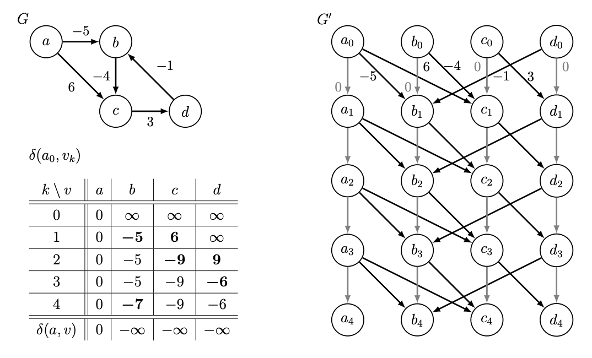

#### 3.4.4 Correctness

- **Claim 3**: $\delta(s_0, v_k) = \delta_k(s,v)$ for all $v \in V$ and $k \in \{0, \dots , |V|\}$

- **Proof**: By induction on $k$: 

  - Base case: true for all $v \in V$ when $k = 0$ (only $v_0$ reachable from $s_0$ is $v = s$) 

  - Inductive Step: Assume true for all $k < k'$ , prove for $k = k'$
    $$
    \begin{aligned}
    \delta(s_0, v_{k'}) &= \min \{\delta(s_0, u_{k'−1}) + w(u_{k'−1}, v_{k_0}) | u_{k'−1} \in \mathrm{Adj}^−(v_{k'}) \} \\
    &= \min \{ \{ \delta(s_0, u_{k'−1}) + w(u, v) | u \in \mathrm{Adj}^−(v)\} \cup \{ \delta(s_0, v_{k'−1}) \}\} \\ 
    &= \min \{ \{\delta_{k'−1}(s, u) + w(u, v) | u \in \mathrm{Adj}^−(v) \} ∪ \{ \delta_{k'−1}(s, v) \} \} (\mathrm{by \ induction}) \\
    &= \delta_{k'}(s, v)
    \end{aligned}
    $$

- **Claim 4**: At the end of Bellman-Ford $d(s, v) = \delta(s, v)$
- **Proof**: Correctly computes $\delta_{|V|−1}(s, v)$ and $\delta_{|V|}(s, v)$ for all $v \in V$ by Claim 3 
  - If $\delta(s, v) \ne −\infin$, correctly sets $d(s, v) = \delta_{|V|−1}(s, v) = \delta(s, v)$
  - Then sets $d(s, v) = −\infin$ for any $v$ reachable from a witness; correct by Claim 2 

#### 3.4.5 Running Time

- $G'$ has size $O(|V|(|V | + |E|))$ and can be constructed in as much time
- Running DAG Relaxation on $G'$ takes linear time in the size of $G'$
- Does $O(1)$ work for each vertex reachable from a witness
- Finding reachability of a witness takes $O(|E|)$ time, with at most $O(|V|)$witnesses: $O(|V||E|) $
- (Alternatively, connect **super node** $x$ to witnesses via $0$-weight edges, linear search from $x$)
- Pruning $G$ at start to only subgraph reachable from $s$ yields $O(|V||E|) $-time algorithm 

### 3.5 Dijkstra's Algorithm

#### 3.5.1 Non-negative Edge Weights

- **Idea!** Generalize BFS approach to weighted graphs: 
  - Grow a sphere centered at source $s$
  - Repeatedly explore closer vertices before further ones
  - But how to explore closer vertices if you don’t know distances beforehand?
- **Observation 1**: If weights non-negative, monotonic distance increase along shortest paths 
  - Let $V_x \subset V$ be the subset of vertices reachable within distance $\le x$ from $s$
  - If $v \in V_x$, then any shortest path from $s$ to $v$ only contains vertices from $V_x$
  - Perhaps grow $V_x$ one vertex at a time! (but growing for every $x$ is slow if weights large) 
- **Observation 2**: Can solve SSSP fast if given order of vertices in increasing distance from s
  - Remove edges  that go against this order (since cannot participate in shortest paths)
  - May still have cycles if zero-weight edges: repeatedly collapse into single vertices 
  - Compute $\delta(s, v)$ for each $v \in V$ using DAG relaxation in $O(|V | + |E|)$ time 

#### 3.5.2 Dijkstra's Algorithm

- **Idea!** Relax edges from each vertex in increasing order of distance from source $s$
- **Idea!** Efficiently find next vertex in the order using a data structure 
- **Changeable Priority Queue** $Q$ on items with keys and unique IDs, supporting operations: 
  - $\mathrm{Q.build(X)}$: initialize $Q$ with items in iterator $X$
  - $\mathrm{Q.delete\_min()}$: remove an item with minimum key Q
  - $\mathrm{Q.decrease\_key(id, k)}$: find stored item with ID id and change key to $k$
- Implement by **cross-linking** a Priority Queue $Q'$ and a Dictionary $D$ mapping IDs into $Q'$
- Assume vertex IDs are integers from $0$ to $|V| − 1$ so can use a direct access array for $D$
- For brevity, say item $x$ is the tuple $(\mathrm{x.id}, \mathrm{x.key})$
- Set $d(s, v) = \infin$ for all $v \in V$ , then set $d(s, s) = 0$
- Build changeable priority queue $Q$ with an item $(v, d(s, v))$ for each vertex $v \in V$
- While $Q$ not empty, delete an item $(u, d(s, u))$ from $Q$ that has minimum $d(s, u)$
  - For vertex $v$ in outgoing adjacencies $\mathrm{Adj}^+(u)$: 
    - If $d(s, v) > d(s, u) + w(u, v)$: 
      - Relax edge $(u, v)$, i.e., set $d(s, v) = d(s, u) + w(u, v)$
      - Decrease the key of $v$ in $Q$ to new estimate $d(s, v)$

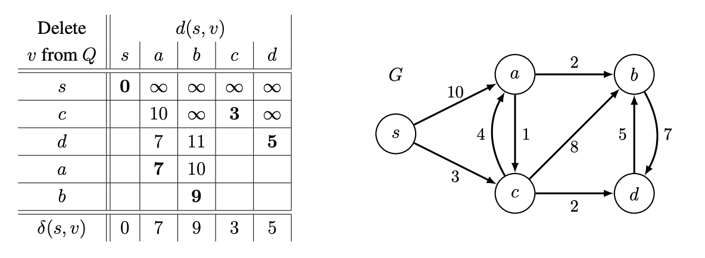

#### 3.5.3 Correctness

- **Claim**: At end of Dijkstra's algorithm, $d(s,v)=\delta(s,v)$ for all $v \in V$

- **Proof**: 

  - If relaxation sets $d(s, v)$ to $\delta(s, v)$, then $d(s, v) = \delta(s, v)$ at the end of the algorithm 

    - Relaxation can only decrease estimates $d(s, v)$
    - Relaxation is safe, i.e., maintains that each $d(s, v)$ is weight of a path to $v$ (or $\infin$) 

  - Suffices to show $d(s, v) = \delta(s, v)$ when vertex $v$ is removed from $Q$

    - Proof by induction on first $k$ vertices removed from $Q$

    - Base Case $(k = 1)$: $s$ is first vertex removed from $Q$, and $d(s, s) = 0 = \delta(s, s)$

    - Inductive Step: Assume true for $k < k'$ , consider $k'$th vertex $v'$ removed from $Q$

    - Consider some shortest path $\pi$ from $s$ to $v'$ , with $w(\pi) = \delta(s, v')$

    - Let $(x, y)$ be the first edge in $\pi$ where $y$ is not among first $k' − 1$ (perhaps $y = v'$ ) 

    - When $x$ was removed from $Q$, $d(s, x) = \delta(s, x)$ by induction, so: 
      $$
      \begin{aligned}
      d(s, y) &\le \delta(s, x) + w(x, y) &\mathrm{relaxed\ edge\ (x, y) \ when\ removed x} \\
      &= \delta(s, y)  &\mathrm{subpaths\ of\ shortest\ paths\ are\ shortest\ paths} \\
      &\le \delta(s,v') &\mathrm{non-negative\ edge\ weights} \\
      &\le d(s, v') &\mathrm{relaxation\ is\ safe} \\
      &\le d(s, y) &\mathrm{v'\ is\ vertex\ with\ minimum\ d(s, v')\ in\ Q}
      
      
      
      \end{aligned}
      $$

    - So $d(s, v') = \delta(s, v')$, as desired

#### 3.5.4 Running Time

- Count operations on changeable priority queue $Q$, assuming it contains $n$ items: 

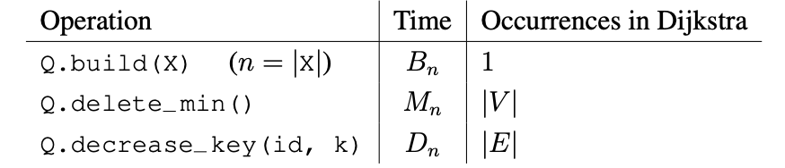

- Total running time is $O(B_{|V|} + |V| · M_{|V|} + |E| · D_{|V|})$
- Assume pruned graph to search only vertices reachable from the source, so $|V | = O(|E|)$

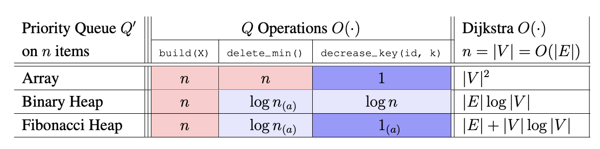

- If graph is dense, i.e., $|E| = \Theta(|V|^2)$, using an Array for $Q'$ yields $O(|V|^2)$ time 
-  If graph is sparse, i.e., $|E| = \Theta(|V|)$, using a Binary Heap for $Q'$ yields $O(|V| \log|V|)$ time 
- A Fibonacci Heap is theoretically good in all cases, but is not used much in practice 
- You should assume Dijkstra runs in $O(|E|+|V| \log |V|)$ time when using in theory problems 

### 3.6 Summary: Weighted Single-Source Shortest Paths

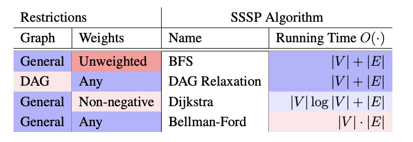

### 3.7 Johnson's Algorithm

#### 3.7.1 All-Pairs Shortest Paths (APSP)

- Input: directed graph $G = (V, E)$ with weights $w : E \rightarrow \mathbb Z$
- Output: $\delta (u, v)$ for all $u, v \in V$ , or abort if $G$ contains negative-weight cycle 
- Useful when understanding whole network, e.g., transportation, circuit layout, supply chains... 
-  Just doing a SSSP algorithm $|V|$ times is actually pretty good, since output has size $O(|V|^2)$
  -  $|V|O(|V | + |E|)$ with BFS if weights positive and bounded by $O(|V | + |E|)$
  -  $|V|O(|V | + |E|)$ with DAG Relaxation if acyclic
  -  $|V|O(|V | \log |V | + |E|)$ with Dijkstra if weights non-negative or graph undirected 
  -  $|V|O(|V||E|) $with Bellman-Ford (general) 
- Solve APSP in any weighted graph in $|V|O(|V|\log|V| + |E|)$ time

#### 3.7.2 Approach

- **Idea**: Make all edge weights non-negative while **preserving shortest paths**! 
- If non-negative, then just run Dijkstra $|V|$ times to solve APSP 
- **Claim**: Can compute distances in $G$ from distances in $G'$ in $O(|V |(|V | + |E|))$ time 
  - Compute shortest-path tree from distances, for each $s \in V'$ in $O(|V |+|E|)$ time
  - Also shortest-paths tree in $G$, so traverse tree with DFS while also computing distances 
  - Takes $O(|V|(|V | + |E|))$ time (which is less time than $|V |$ times Dijkstra) 
- But how to make $G'$ with non-negative edge weights? Is this even possible?? 
- **Claim**: Not possible if $G$ contains a negative-weight cycle 
- **Proof**: Shortest paths are simple if no negative weights, but not if negative-weight cycle

#### 3.7.3 Making Weights Non-negative 1

- **Idea!** Add negative of smallest weight in G to every edge! All weights non-negative! 
- **FAIL**: Does not preserve shortest paths! Biases toward paths traversing fewer edges
- **Idea!** Given vertex $v$, add $h$ to all outgoing edges and subtract $h$ from all incoming edges
- **Claim**: Shortest paths are preserved under the above reweighting 
- **Proof**: 
  - Weight of every path starting at $v$ changes by $h$
  - Weight of every path ending at $v$ changes by $−h$
  - Weight of a path passing through $v$ **does not change** (locally) 
- This is a very general and useful trick to transform a graph while preserving shortest paths! 
- Even works with multiple vertices! 
- Define a **potential function** $h : V \rightarrow \mathbb Z$ mapping each vertex $v \in V$ to a potential $h(v)$
- Make graph $G'$ : same as $G$ but edge $(u, v) \in E$ has weight $w'(u, v) = w(u, v)+h(u)−h(v)$
- **Claim**: Shortest paths in $G$ are also shortest paths in $G'$
- **Proof**:
  - Weight of path $\pi = (v_0, \dots , v_k)$ in $G$ is $w(\pi) = \sum_{i=1}^k w(v_{i−1}, v_i)$
  - Weight of $\pi$ in $G'$ is: $\sum_{i=1}^k w(v_{i−1}, v_i) + h(v_i−1) − h(v_i) = w(\pi) + h(v_0) − h(v_k)$
  - (Sum of $h$’s telescope, since there is a positive and negative $h(v_i)$ for each interior $i$) 
  - Every path from $v_0$ to $v_k$ changes by the same amount 
  - So any shortest path will still be shortest 

#### 3.7.4 Making Weights Non-negative 2

- Can we find a potential function such that $G'$ has no negative edge weights? 
- i.e., is there an h such that $w(u, v) + h(u) − h(v) \ge 0$ for every $(u, v) \in E$? 
- Re-arrange this condition to $h(v) \le h(u) + w(u, v)$, looks like **triangle inequality**! 
- **Idea!** Condition would be satisfied if $h(v) = \delta(s, v)$ and $\delta(s, v)$ is finite for some $s$
- But graph may be disconnected, so may not exist any such vertex $s$... 
- **Idea!** Add a new vertex $s$ with a directed 0-weight edge to every $v \in V$ ! 
- $\delta(s, v) \le 0$ for all $v \in V$ , since path exists a path of weight 0
- **Claim**: If $\delta(s, v) = −\infin$ for any $v \in V$, then the original graph has a negative-weight cycle 
- **Proof**:
  - Adding s does not introduce new cycles (s has no incoming edges) 
  - So if reweighted graph has a negative-weight cycle, so does the original graph
- Alternatively, if $\delta(s, v)$ is finite for all $v \in V$ : 
  - $w'(u, v) = w(u, v) + h(u) − h(v) \ge 0$ for every $(u, v) \in E$ by triangle inequality!
  - New weights in $G'$ are non-negative while preserving shortest paths! 

#### 3.7.5 Johnson’s Algorithm

- Construct $G_x$ from $G$ by adding vertex $x$ connected to each vertex $v \in V$ with 0-weight edge 
- Compute $\delta_x(x, v)$ for every $v \in V$ (using Bellman-Ford)
- If $\delta_x(x, v) = −\infin$ for any $v \in V$ : 
  - Abort (since there is a negative-weight cycle in $G$) 
- Else: 
  - Reweight each edge $w'(u, v) = w(u, v) + \delta_x(x, u) − \delta_x(x, v)$ to form graph $G'$
  - For each $u \in V$ :
    - Compute shortest-path distances $\delta'(u, v)$ to all $v$ in $G'$ (using Dijkstra) 
    - Compute $\delta(u, v) = \delta' (u, v) − \delta_x(x, u) + \delta_x(x, v)$ for all $v \in V$

#### 3.7.6 Correctness

- Already proved that transformation from $G$ to $G'$ preserves shortest paths 
- Rest reduces to correctness of Bellman-Ford and Dijkstra
- Reducing from **Signed APSP** to **Non-negative APSP**
- Reductions save time! No induction today!

#### 3.7.7 Running Time

- $O(|V | + |E|)$ time to construct $G_x$
- $O(|V ||E|)$ time for Bellman-Ford 
- $O(|V | + |E|)$ time to construct $G'$
- $O(|V |(|V | \log |V | + |E|))$ time for $|V |$ runs of Dijkstra
- $O(|V|^2)$ time to compute distances in $G$ from distances in $G'$
- $O(|V|^2 \log |V| + |V||E|)$ time in total 

## 4. Dynamic Programming

- Hard part is thinking inductively to construct recurrence on subproblems
- How to solve a problem recursively (SRT BOT)
  - **Subproblem** definition
  - **Relate** subproblem solutions recursively
  - **Topological** order on subproblems ($\rightarrow$ subproblem DAG) 
  - **Base** cases of relation
  - **Original** problem solution via subproblem(s)
  - **Time** analysis

