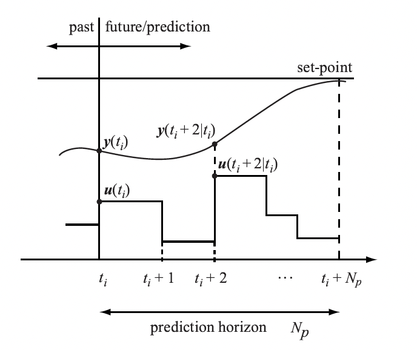
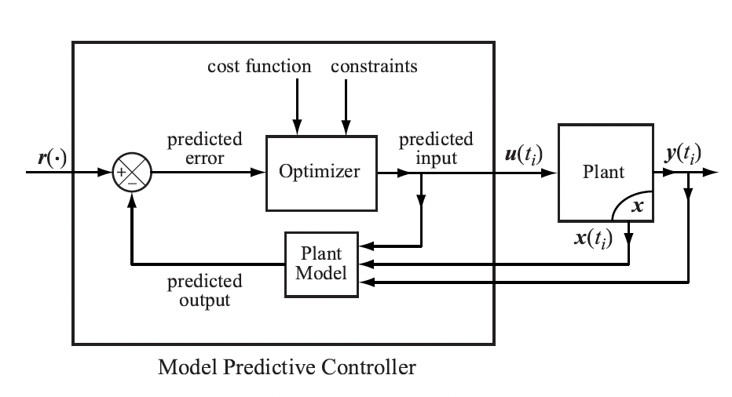

# Control Theory

## 1. PID Controller

$$
u(t) = K_pe(t)+K_I\int^t_0e(t)dt+K_d\frac{de}{dt}
$$

A typical problem of **P** Controller: ***steady state error***. We can understand it: A steady state is reached when the quantity generated by the error is equal to the quantity that is natually increased/lost.

The **I** Controller is a nice solution of the steady state error. There are other problems however, where it might not be enough to look into the past with the integral term. We also need to look into the future. 

When you set the parameters $K_p,K_i,K_d$ in a control system, the **D** Controller seems not helpful. But actually the derivative term of the PID controller is very important. The overshoot due to inertia can be tackled by the derivative term, which is

$$
u(t) = K_d \frac{de}{dt} = K_d \frac{d}{dt}(p_d-p(t))=K_d(0- \frac{dp}{dt})=-K_d\frac{dp}{dt}
$$

If the velocity $dp/dt$ is positive (upwards), the control $u$, which is the acceleration $a$, will be negative (downwards). Hence the derivative term acts against the problem of overshoot and oscillation.

## 2. MPC Controller

In the MPC approach, the current control action is computed on-line rather than using a pre-computed, off-line, control law.

A model predictive controller uses, at each sampling instant, the pllant's current input and output measurements, the plant's current state, and the plant's model to

- calculate, over **a finite horizon, a future control sequence** that optimizes a given performance index and satisfies constraints on the control action;
- use **the first control** in the sequence as the plant's input

The basic structure of an MPC-controlled plant:

### 2.1 From Continuous to Discrete Models

Our objective is to present a method for constructing linear discrete-time models from given linear continuous-time models. The obstained discrete models will be used to perform competations to generate control commands.

We use a sample-and-hold device that transforms a continuous signal, $f(t)$, into the straircase signal,
$$
f(kh), kh \le t < (k+1)h
$$
Suppose that we are given a continuous-time model,
$$
\begin{aligned}
& \dot x(t) = \boldsymbol A x(t) + \boldsymbol B u(t), \ \ x_0=x(t_0) \\
& y(t) = \boldsymbol Cx(t)
\end{aligned}
$$
The solution to the state equation is
$$
x(t) = e ^ {\boldsymbol A(t-t_0)} x(t_0)+\int^{t}_{t_0} e ^ {\boldsymbol A(t-\tau)} \boldsymbol B u(\tau)d\tau
$$
We assume that the input to the system is generated by a sample-and-hold device and has the form,
$$
u(t) = u(k), \ kh \le t <(k+1)h
$$
 Let $t_0 = kh$ and $t=(k+1)h$ and let us use shorthand notation 
$$
x(kh)=x(k)
$$
Then taking into account that $u(k)$ is constant on the interval $[kh, (k+1)h]$ we represent as
$$
\begin{aligned}
x(k+1) &= e ^ {\boldsymbol Ah} x(k)+\int^{(k+1)h}_{kh} e ^ {\boldsymbol A(kh+h-\tau)} \boldsymbol B u(k)d\tau
\\ &= e ^ {\boldsymbol Ah} x(k)+u(k)\int^{(k+1)h}_{kh} e ^ {\boldsymbol A(kh+h-\tau)} \boldsymbol B d\tau
\end{aligned}
$$
Consider now the second term on the right-hand side of the above equation. Let
$$
\eta = (k+1)h - \tau
$$
Then we can represent $(8)$ as
$$
\begin{aligned}
x(k+1) &= e ^ {\boldsymbol Ah} x(k)+u(k)\int^{(k+1)h}_{kh} e ^ {\boldsymbol A(kh+h-\tau)} \boldsymbol B d\tau
\\ &= e ^ {\boldsymbol Ah} x(k)+u(k)\int^{h}_{h} e ^ {\boldsymbol A\eta} \boldsymbol B d\eta
\\ &= \boldsymbol \Phi x(k)+\boldsymbol \Gamma u(k)
\end{aligned}
$$
where
$$
\boldsymbol \Phi = e ^ {\boldsymbol Ah} \ \ \mathrm {and} \ \  \boldsymbol \Gamma=\int^{h}_{h} e ^ {\boldsymbol A\eta} \boldsymbol B d\eta
$$
The discrete output equation has the form
$$
y(k)=\boldsymbol Cx(k)
$$
### 2.2 Simple Discrete-Time MPC

We consider a discretized model of a dynamic system of the form,
$$
\begin{aligned}
x(k+1) &= \boldsymbol \Phi x(k) + \boldsymbol \Gamma u(k)
\\ y(k) &= \boldsymbol Cx(k)
\end{aligned}
$$
Where $\boldsymbol \Phi \in \mathbb R^{n \times n}, \boldsymbol \Gamma \in \mathbb R^{n \times m}, \mathrm {and} \ \boldsymbol C \in \mathbb R^{p \times n}$.

Applying the backward difference operator, $\Delta x(k+1) = x(k+1)-x(k)$ 
$$
\begin{aligned}
\Delta x(k+1) &= \boldsymbol \Phi \Delta x(k) + \boldsymbol \Gamma \Delta u(k)
\\ \Delta y(k+1) &= \boldsymbol C\Delta x(k+1)
\end{aligned}
$$
Hence,
$$
y(k+1) = y(k) + \boldsymbol C\boldsymbol \Phi \Delta x(k) + \boldsymbol C\boldsymbol \Gamma \Delta u(k)
$$
We combine the above into one equation to obtain 
$$
\left[
\begin{matrix}
 \Delta x(k+1) \\
 y(k+1)   \\
\end{matrix}
\right]
=
\left[
\begin{matrix}
 \boldsymbol \Phi & \boldsymbol O \\
 \boldsymbol C \boldsymbol \Phi & \boldsymbol I_p   \\
\end{matrix}
\right]
\left[
\begin{matrix}
 \Delta x(k) \\
 y(k)   \\
\end{matrix}
\right]
+
\left[
\begin{matrix}
 \boldsymbol \Gamma \\
 \boldsymbol C \boldsymbol \Gamma   \\
\end{matrix}
\right]
\Delta u(k)
$$
and
$$
y(k) = 
\left[
\begin{matrix}
 \boldsymbol O & \boldsymbol I_p \\
\end{matrix}
\right]
\left[
\begin{matrix}
 \Delta x(k) \\
 y(k)
\end{matrix}
\right]
$$
We now define the augmented state vector,
$$
x_a(k)=
\left[
\begin{matrix}
 \Delta x(k) \\
 y(k)
\end{matrix}
\right]
$$
 Let
$$
\boldsymbol \Phi_a = 
\left[
\begin{matrix}
 \boldsymbol \Phi & \boldsymbol O \\
 \boldsymbol C \boldsymbol \Phi & \boldsymbol I_p   \\
\end{matrix}
\right],\ 
\boldsymbol \Gamma_a = 
\left[
\begin{matrix}
 \boldsymbol \Gamma \\
 \boldsymbol C \boldsymbol \Gamma   \\
\end{matrix}
\right], \ 
\boldsymbol C_a = \left[
\begin{matrix}
 \boldsymbol O & \boldsymbol I_p \\
\end{matrix}
\right]
$$
Using the above notation, we get
$$
\begin{aligned}
x_a(k+1) &= \boldsymbol \Phi_a x_a(k) + \boldsymbol \Gamma_a u(k)
\\ y(k) &= \boldsymbol C_a x_a(k)
\end{aligned}
$$
Where $\boldsymbol \Phi \in \mathbb R^{(n+p) \times (n+p)}, \boldsymbol \Gamma \in \mathbb R^{(n+p) \times m}, \mathrm {and} \ \boldsymbol C \in \mathbb R^{p \times (n+p)}$.

Suppose now that the state vector $x_a$ at each sampling time, $k$, is available to us. Our control objective is to construct a control sequence,
$$
\Delta u(k),\Delta u(k+1),...,\Delta u(k+N_p-1)
$$
Where $N_p$ is the prediction horizon, such that a given cost function and constraints are satisfied. The above control sequence will result in a predicted sequence of the state vector,
$$
x_a(k+1|k),x_a(k+2|k),...,x_a(k+N_p|k)
$$
which can then be used to compute predicted sequence of the plant's outputs,
$$
y(k+1|k),y(k+2|k),...,x(k+N_p|k)
$$
Using the above information, we can compute the control sequence and the then apply $u(k)$ to the plant to generate $x(k+1)$. We reqeat the process again, using $x(k+1)$ as an initial condition to compute $u(k+1)$, until we reach the boundary of the control horizon, $N_c$.

We now present an approach to construct $u(k)$ given $x(k)$. Using the plant model parameters and the measurement of $x_a(k)$ we evaluate the augmented states over the prodiction horizon successively applying the recurison formula to obtain,
$$
\begin{aligned}
x_a(k+1|k) &= \boldsymbol \Phi x_a(k) + \boldsymbol \Gamma_a\Delta u(k)\\
x_a(k+2|k) &= \boldsymbol \Phi x_a(k+1) + \boldsymbol \Gamma_a\Delta u(k+1)\\
& \ \ \ \ = \boldsymbol \Phi^2 x_a(k) + \boldsymbol \Phi_a\boldsymbol \Gamma_a\Delta u(k) + \boldsymbol \Gamma_a\Delta u(k+1)\\
\vdots \\
x_a(k+N_p|k) &= \boldsymbol \Phi^{N_p} x_a(k) + \boldsymbol \Phi_a^{N_p-1}\boldsymbol \Gamma_a\Delta u(k)+...+\boldsymbol \Gamma_a\Delta u(k+N_p-1)
\end{aligned}
$$
We represent the above set of equations in the form
$$
\left[
\begin{matrix}
 x_a(k+1|k) \\
 x_a(k+2|k) \\
 \vdots \\ 
 x_a(k+N_p|k) 
\end{matrix}
\right]
=
\left[
\begin{matrix}
 \boldsymbol \Phi_a \\
 \boldsymbol \Phi_a^2 \\
 \vdots \\ 
 \boldsymbol \Phi_a^{N_p}
\end{matrix}
\right]
x_a(k)
+
\left[
\begin{matrix}
 \boldsymbol \Gamma_a \\
 \boldsymbol \Phi_a \boldsymbol \Gamma_a & \boldsymbol \Gamma_a  \\
 \vdots  & &\ddots\\ 
 \boldsymbol \Phi_a^{N_p-1}\boldsymbol \Gamma_a & &... &\boldsymbol \Gamma_a
\end{matrix}
\right]
\left[
\begin{matrix}
	\Delta u(k) \\
	\Delta u(k+1) \\
 	\vdots \\
	\Delta u(k+N_p-1) \\
\end{matrix}
\right]
$$
We wish to design a controller that would force the plant output, $y$, to track a given reference signal, $r$.
$$
\left[
\begin{matrix}
 y(k+1|k) \\
 y(k+2|k) \\
 \vdots \\ 
 y(k+N_p|k) 
\end{matrix}
\right]
=
\left[
\begin{matrix}
 C_a x_a(k+1|k) \\
 C_a x_a(k+2|k) \\
 \vdots \\ 
 C_a x_a(k+N_p|k) 
\end{matrix}
\right]
\\
=
\left[
\begin{matrix}
 C_a \boldsymbol \Phi_a \\
 C_a \boldsymbol \Phi_a^2 \\
 \vdots \\ 
 C_a \boldsymbol \Phi_a^{N_p} 
\end{matrix}
\right]
x_a(k)
+
\left[
\begin{matrix}
 C_a \boldsymbol \Gamma_a \\
 C_a \boldsymbol \Phi_a \boldsymbol \Gamma_a & C_a \boldsymbol \Gamma_a  \\
 \vdots  & &\ddots\\ 
 C_a \boldsymbol \Phi_a^{N_p-1}\boldsymbol \Gamma_a & &... &C_a\boldsymbol \Gamma_a
\end{matrix}
\right]
\left[
\begin{matrix}
	\Delta u(k) \\
	\Delta u(k+1) \\
 	\vdots \\
	\Delta u(k+N_p-1) \\
\end{matrix}
\right]
$$
We write the above compactly as
$$
Y = W x_a(k)+ Z\Delta U
$$
where
$$
Y =
\left[
\begin{matrix}
 y(k+1|k) \\
 y(k+2|k) \\
 \vdots \\ 
 y(k+N_p|k) 
\end{matrix}
\right],\ 
\Delta U =
\left[
\begin{matrix}
	\Delta u(k) \\
	\Delta u(k+1) \\
 	\vdots \\
	\Delta u(k+N_p-1) \\
\end{matrix}
\right],
$$
and
$$
W=\left[
\begin{matrix}
 C_a \boldsymbol \Phi_a \\
 C_a \boldsymbol \Phi_a^2 \\
 \vdots \\ 
 C_a \boldsymbol \Phi_a^{N_p} 
\end{matrix}
\right]
,\ 
Z =
\left[
\begin{matrix}
 C_a \boldsymbol \Gamma_a \\
 C_a \boldsymbol \Phi_a \boldsymbol \Gamma_a & C_a \boldsymbol \Gamma_a  \\
 \vdots  & &\ddots\\ 
 C_a \boldsymbol \Phi_a^{N_p-1}\boldsymbol \Gamma_a & &... &C_a\boldsymbol \Gamma_a
\end{matrix}
\right]
$$
Suppose now that we wish to construct a control sequence, $\Delta u(k),...,\Delta u(k+N_p-1)$, that would minimize the cost function 
$$
J(\Delta U) = \frac{1}{2}(r_p-Y)^TQ(r_p-Y)+\frac{1}{2}(\Delta U)^TR\Delta U
$$
where $Q=Q^>0$ and $R=R^\top>0$ are real symmetric positive semi-deinfite and positive-definite weight matrics, respectively. The multipling scalar, 1/2, is just to make subsequent manipulations cleaner. Finally, the vector $r_p$ Consist of the values of the command signal at sampling times, $k,k+1,...,k+N_p-1$. The selection of the weight metrics, $Q$ and $R$ reflects our control objective to keep the tracking error $||r_p-Y||$ "small" using the control actions that are "not too large".

We first apply the first-order necessary conditios (FONC) test to $J\Delta U$
$$
\frac{\partial J}{\partial \Delta U} = 0^\top
$$
Then, we solve the above equation for $\Delta U = \Delta U ^ *$, where
$$
\frac{\partial J}{\partial \Delta U} = -(r_p-Wx_a-Z\Delta U)^\top QZ+\Delta U^\top R=0^\top
$$
Performing simple manipulations yields
$$
-r_p^\top QZ+x_a^\top W^\top QZ+\Delta U^\top Z^\top QZ+\Delta U^\top R=0^\top
$$
Applying the transposition operation to both sides of the above equation and rearranging terms, we obtain
$$
(R+Z^\top QZ)\Delta U = Z^\top Q(r_p-Wx_a)
$$
Note that the matrix $(R+Z^\top QZ)$ is invertible, and in fact, positive definite because $R=R^\top > 0$ and $Z^\top QZ$ is also symmetric and at least positive semi-definite. Hence, $\Delta U$ that satisfies the FONC is
$$
\Delta U ^* = (R+Z^\top QZ)^{-1}Z^\top Q(r_p-Wx_a)
$$
Now, applying the second derivative test to $J(\Delta U)$, which we refer to as the second-order suffciency condition (SONC), we obtain
$$
\frac{\partial^2 J}{\partial \Delta U^2} = R+Z^\top QZ > 0
$$
which implies that $\Delta U^*$ is a strict minimizer of $J$. 

Using $(35)$, We compute $\Delta u(k)$,
$$
\begin{aligned}
\Delta u(k) &= \left[
\begin{matrix}
 I_m & O & \cdot \cdot \cdot  &O
\end{matrix}
\right](R+Z^\top QZ)^{-1}Z^\top  Q(r_p-Wx_a) \\
&=\boldsymbol{K_r} r_p-\boldsymbol {K_x}\Delta x(k)-\boldsymbol {K_y}y(k)
\end{aligned}
$$
where
$$
\boldsymbol{K_r} =\left[
\begin{matrix}
 I_m & O & \cdot \cdot \cdot  &O
\end{matrix}
\right]
(R+Z^\top QZ)^{-1}Z^\top Q, \ \
\boldsymbol {K_x} = \boldsymbol{K_r}W
\left[
\begin{matrix}
 I_n \\
 O
\end{matrix}
\right]
$$
and 
$$
\boldsymbol {K_x} = \boldsymbol{K_r}W
\left[
\begin{matrix}
 O \\
 I_p
\end{matrix}
\right]
$$

### 2.3 MPC with Constraints

An attractive feature of the model-based predictive control approach is that a control engineer can incorporate different types of constraints on the control action. We consider three types of such constraints.

#### 2.3.1 Constraints on the Rate of Change of the Control Action

Hard constraints on the rate of change of the control signal can be expressed as
$$
\Delta u_t^{\mathrm{min}} \le \Delta u_i(k) \le \Delta u_t^{\mathrm{max}},\ \ i=1,2,...,m
$$
Let
$$
\Delta u_t^{\mathrm{min}} = 
\left[
\begin{matrix}
\Delta u_1^{\mathrm{min}} &\cdot \cdot \cdot & \Delta u_m^{\mathrm{min}}
\end{matrix}
\right]^\top \  \ 
\mathrm {and} \ \ 
\Delta u_t^{\mathrm{max}} = 
\left[
\begin{matrix}
\Delta u_1^{\mathrm{max}} &\cdot \cdot \cdot & \Delta u_m^{\mathrm{max}}
\end{matrix}
\right]^\top
$$
Then, we express $(40)$ as
$$
\Delta u ^{\mathrm{min}} \le \Delta u(k) \le \Delta u ^{\mathrm{max}}
$$
The above can be equivalent represented as
$$
\left[
\begin{matrix}
-I_m \\
I_m
\end{matrix}
\right]
\Delta u(k) \le
\left[
\begin{matrix}
-\Delta u^{\mathrm{min}} \\
\Delta u^{\mathrm{max}}
\end{matrix}
\right]
$$
Using the above approach we can represent constraints on the rate of change of the control action over the whole prediction horizon, $N_p$, in terms of $\Delta U(k)$, by augmenting the above inequality to incorporate constraints for the remaining sampling times. That is, if the above constraints are imposed on the rate of change of the control action for all sampling times within the prediction horizon, the this canbe expressed in terms of $\Delta U(k)$ as
$$
\left[
\begin{matrix}
 -I_m &O &\cdots &O &O \\ 
 I_m &O &\cdots &O &O \\ 
 O &-I_m &\cdots &O &O \\ 
 O &I_m &\cdots &O &O \\ 
 \vdots & & & & \vdots \\
 O &O &\cdots &-I_m &O \\ 
 O &O &\cdots &I_m &O \\ 
 O &O &\cdots &O &-I_m \\ 
 O &O &\cdots &O &I_m \\
\end{matrix}
\right]
\left[
\begin{matrix}
 \Delta u(k) \\
 \Delta u(k+1) \\
 \vdots \\
 \Delta u(k+N_p-2) \\
 \Delta u(k+N_p-1) \\
\end{matrix}
\right]
\le
\left[
\begin{matrix}
 -\Delta u^{\mathrm{min}} \\
 \Delta u^{\mathrm{max}}  \\
  -\Delta u^{\mathrm{min}} \\
 \Delta u^{\mathrm{max}}  \\
 \vdots \\
 -\Delta u^{\mathrm{min}} \\
 \Delta u^{\mathrm{max}}  \\
  -\Delta u^{\mathrm{min}} \\
 \Delta u^{\mathrm{max}}  \\
\end{matrix}
\right]
$$
On the other hand, if the constraints on the rate of the control of the control are imposed only on the first component of $\Delta U(k)$, then we express this in terms of $\Delta U(k)$ as
$$
\left[
\begin{matrix}
-I_m &O &\cdots &O &O\\
I_m &O &\cdots &O &O
\end{matrix}
\right]
\Delta U(k) \le
\left[
\begin{matrix}
-\Delta u^{\mathrm{min}} \\
\Delta u^{\mathrm{max}}
\end{matrix}
\right]
$$

#### 2.3.2 Constraints on the Control Action Magnitude

Hard constraints on the control action magnitude at the time sampling $k$ have the form
$$
 u_t^{\mathrm{min}} \le  u_i(k) \le  u_t^{\mathrm{max}},\ \ i=1,2,...,m
$$
We now express constraints on the control action magnitude over the whole prediction horizon in terms of $\Delta U(k)$. To accomplish our goal, we first note that
$$
\begin{aligned}
u(k) &= u(k-1) + \Delta u(k) \\
     &= u(k-1) + \left[ \begin{matrix} I_m &O &\cdots &O\\ \end{matrix}\right]\Delta U(k)
\end{aligned}
$$
Where, recall that $\Delta U =
\left[
\begin{matrix}
	\Delta u(k) &\Delta u(k+1) \cdots &\Delta u(k+N_p-1) 
\end{matrix}
\right]^\top$

Similarly,
$$
\begin{aligned}
u(k+1) &= u(k) + \Delta u(k+1) \\
     &= u(k-1) + \left[ \begin{matrix} I_m &O &\cdots &O\\ \end{matrix}\right]\Delta U(k) +\Delta u(k+1) \\
     &= u(k-1) + \left[ \begin{matrix} I_m &I_m &\cdots &O\\ \end{matrix}\right]\Delta U(k)
\end{aligned}
$$
Continuing in this manner, we obtain
$$
\left[
\begin{matrix}
 u(k) \\
 u(k+1) \\
 \vdots \\ 
 u(k+N_p-1) 
\end{matrix}
\right]
=
\left[
\begin{matrix}
  I_m \\
  I_m \\
 \vdots \\ 
  I_m
\end{matrix}
\right]
u(k-1)
+
\left[
\begin{matrix}
 I_m \\
 I_m & I_m \\
 \vdots  & &\ddots\\ 
 I_m & I_m &... &I_m
\end{matrix}
\right]
\left[
\begin{matrix}
	\Delta u(k) \\
	\Delta u(k+1) \\
 	\vdots \\
	\Delta u(k+N_p-1) \\
\end{matrix}
\right]
$$
Let
$$
E=\left[
\begin{matrix}
 I_m \\
 I_m \\
 \vdots \\ 
 I_m
\end{matrix}
\right] \ \  \mathrm{and}\ \ 
H=
\left[
\begin{matrix}
 I_m \\
 I_m & I_m \\
 \vdots  & &\ddots\\ 
 I_m & I_m &... &I_m
\end{matrix}
\right]
$$
Then, we can represent $(49)$ as
$$
U(k) = Eu(k-1)+H\Delta U(k)
$$
Suppose now that we are faced with constructing a control action subject to the following constraints,
$$
U^{\mathrm{min}} \le U(k) \le U^{\mathrm{max}}
$$
The above constraints can be equivalently represented as
$$
\left[
\begin{matrix}
-U(k) \\
U(k)
\end{matrix}
\right]
\le
\left[
\begin{matrix}
U^{\mathrm{min}} \\
U^{\mathrm{max}}
\end{matrix}
\right]
$$
Taking into account $(51)$, we write the above as 
$$
\left[
\begin{matrix}
-(Eu(k-1)+H\Delta U(k)) \\
Eu(k-1)+H\Delta U(k)
\end{matrix}
\right]
\le
\left[
\begin{matrix}
U^{\mathrm{min}} \\
U^{\mathrm{max}}
\end{matrix}
\right]
$$
The above, in turn, can be represented as
$$
\left[
\begin{matrix}
-H \\
H
\end{matrix}
\right]
\Delta U(k)
\le
\left[
\begin{matrix}
-U^{\mathrm{min}}+Eu(k-1) \\
U^{\mathrm{max}}-Eu(k-1)
\end{matrix}
\right]
$$
In a special case, when a control designer elects to impose constraints only on the first component of $\Delta U(k)$, that is, on $\Delta u(k)$ ony, then this scenario is expressed in terms of $\Delta U(k)$ as 
$$
\left[
\begin{matrix}
-I_m & O & \cdots & O\\
I_m & O & \cdots & O\
\end{matrix}
\right]
\Delta U(k)
\le
\left[
\begin{matrix}
-U^{\mathrm{min}}+Eu(k-1) \\
U^{\mathrm{max}}-Eu(k-1)
\end{matrix}
\right]
$$

#### 2.3.3 Constraints on the Plant Output

Recall form $(27)$ that the predicted plant output is, $Y(k) = Wx_a(k)+Z\Delta U(k)$. Suppose now that following constraints are imposed on the predicted plant's output,
$$
Y^{\mathrm{min}} \le Y(k) \le Y^{\mathrm{max}}
$$
We represent the above as
$$
\left[
\begin{matrix}
-Y(k) \\
Y(k)
\end{matrix}
\right]
\le
\left[
\begin{matrix}
Y^{\mathrm{min}} \\
Y^{\mathrm{max}}
\end{matrix}
\right]
$$
Taking into the account the expression for $Y$ given by $(27)$, we represent the above as
$$
\left[
\begin{matrix}
-Z \\
Z
\end{matrix}
\right]
\Delta U(k)
\le
\left[
\begin{matrix}
	-Y^{\mathrm{min}}+Wx_a(k) \\
	Y^{\mathrm{max}}-Wx_a(k)
\end{matrix}
\right]
$$

The above discussion clearly demonstrates that we need an effective method of minimizing a function of many variables, $J(\Delta U)$, subject to inequality constraints such as given by $(43)$, $(54)$, and $(59)$, or their combination. In the following, we present a powerful method for solving such optimization problems. This is the method that we shall use to implement our MPCs.

## 2.4 An Optimizer for Solving Constrained Optimization Problems 

If follows from the discussion in the previous section that at each sampling time the MPC calls for a solution to a constrainted optimization problem of the form,
$$
\mathrm{minimize} \ \ \ J(\Delta U) \\
\mathrm{subject \ to} \ \ \ g(\Delta U) \le 0
$$
where $g(\Delta U) \le 0$ contain inequality constrains given by $(43)$, $(54)$, and $(59)$, or their combination. In this section, we present an iterative methods for solving the above optimization problems. To proceed, we first present the descent gradient method, followed by the Newton's method, for solving unconstrained optimization problems of the forms,
$$
\mathrm{minimize} \ \ \ J(\Delta U)
$$

#### 2.4.1 Gradient Descent Method

For the sake of simplicity, we denote the argument of a function of many variables as $x$, where $x \in \mathbb R^N$, and the function that we will be minimizing will be denoted as $f$, where $f:\mathbb R^N \to \mathbb R$.

The method of the gradient descent is based on the following property of the gradient of a differentiable function, $f$, on $\mathbb R^N$:

**Theorem 1**   At a given point $x^{(0)}$, the vector
$$
v = - \nabla f (x^{(0)})
$$
points in the direction of most rapid decrease of $f$ and the rate of increase of $f$ at $x^{(0)}$ in the direction $v$ is $-\| \nabla f(x^{(0)})\|$, equivalently, the rate of decrease of $f$ at $x^{(0)}$ in the direction $v$ is $\| \nabla f(x^{(0)})\|$.

Thus, if we wish to minimize a differantiable function, $f$, then moving in the direction of the negative gradient is a good direction. The gradient descent algorithm rests on the above observation and has the form,
$$
x^{(k+1)} = x^{(k)} - \alpha \nabla f(x^{(k)})
$$
Where $\alpha > 0$ is a step size.

#### 2.4.2 Second-Order Necessary Conditions for a Minimum

Suppose we are given a function $f$ of one variable $x$. Recall a well-known theorem referred to as the second-order Taylor's formula.

**Theorem 2**   Suppose that $f(x)$, $f'(x)$, $f''(x)$ exist on the closed interval $[a, b]=\{x \in \mathbb R:a \le x \le b \}$. If $x^*$, $x$ are any two different points of $[a, b]$, then there exists a point $z$ strictly between $x^*$ and $x$ such that 
$$
f(x) = f(x^*) + f'(x^*)(x-x^*) + \frac{f''(z)}{2}(x-x^*)^2
$$
Using the above formula we obderve that if

- $f'(x^*) = 0$, and
- $f''(x^*) > 0$

then
$$
f(x) = f(x^*) + \mathrm{a \ positive \ number} 
$$
for all $x$ "close" to $x^*$. Indeed, if $f''(x)$ is continuous at $x^*$ and $f''(x^*)>0$, then $f''(x)>0$ for all $x$ in some neighborhoods of $x^*$. Therefore,
$$
f(x) > f(x^*) \ \ \mathrm{for \ all} \ x \mathrm{close \ to} \ x^*
$$
which means that $x^*$ is a strict local minimizer of $f$.

We now extend the above result for functions of many variables. To proceed, we need the second-order Taylor's formula for such functions.

**Theorem 3**  Suppose that $x^*$, $x$ are points in $\mathbb R^N$ and that $f$ is a funtion of $N$ variables with continuous first and second partial derivatives on some open set containing the line segment
$$
[x^*, x] = \{w \in \mathbb{R}^N : w = x^* + t(x - x^*); \ 0 \leq t \leq 1\}
$$
joinning $x^*$ and $x$. Then there exists a $z \in [x^*,x]$ such that
$$
f(x) = f(x^*) + \nabla f(x^*)^\top(x-x^*)+\frac{1}{2}(x-x^*)^\top F(z)(x-x^*)
$$
Where $F(\cdot)$ is the Hessian of $f$, that is, the second derivative of $f$.

Hence if

- $x^*$ is a critical point, that is, $\nabla f(x^*)=0$, and
- $F(x^*) \le 0$

then using $(68)$, we conclude that
$$
f(x) = f(x^*) + 0 + \mathrm{a \  positive \ number}
$$
for all $x$ in a neighborhood of $x^*$. Therefore for all $x \ne x^*$ in some neighborhood of $x^*$, we have
$$
f(x) > f(x^*)
$$
 which implies that $x^*$ is a strict local minimizer.

#### 2.4.3 Newton's Method

The idea behind Newton's method for function minimization is to minimize the quadratic approximation rather than the function itself. Newton's method

seeks a critical point, $x^*$, if a given function. If at this critical point we have $F(x^*)>0$, then $x^*$ is a strict local minimizer of $f$.

We can obtain a quadratic approximation $q$ of $f$ at $x^*$ from the second-order Taylor series expansion of $f$ about $x^*$
$$
q(x) = f(x^*) + \nabla f(x^*)^\top(x-x^*)+\frac{1}{2}(x-x^*)^\top F(x^*)(x-x^*)
$$
Note that 
$$
q(x^*)=f(x^*), \ \ \nabla q(x^*) = \nabla f(x^*)
$$
as well as their Hessians, that is, their second derivatives evaluated at $x^*$ are equal.

A critical point of $q$ can be obtained by solving the algebraic equation,
$$
\nabla q(x) = 0
$$
that is, by soving the equation 
$$
\nabla q(x) = \nabla f(x^*) + F(x^*)(x-x^*) = 0
$$
Suppose now that we have a quadratic approximation of $f$ at a point $x^{(k)}$, that is,
$$
q(x) = f(x^{(k)}) + \nabla f(x^{(k)})^\top(x-x^{(k)})+\frac{1}{2}(x-x^{(k)})^\top F(x^{(k)})(x-x^{(k)})
$$
We assume that $\Delta F(x^{(k)}) \ne 0$. Denoting the solution to the above equation as $x^{(k+1)}$, we obtain
$$
x^{(k+1)} = x^{(k)} - F(x^{(k)})^{-1}\nabla f(x^{(k)})
$$
The above is known as the Newton's method for minimizing a function of many variables  $f$. Note that $x^{(k+1)}$ is a critical point of the quadratic function $q$ that approximates $f$ at $x^{(k)}$.

A computationally efficient reprosentation of Newton's algorithm has the form,
$$
x^{(k+1)} = x^{(k)} - \Delta x^{(k)}
$$
Where $\Delta x ^{(k)}$ is obtained by solving the equation,
$$
F(x^{(k)})\Delta x^{(k)} = \nabla f(x^{(k)})
$$

### 2.5 Minimization Subject to Equality Constraints 

We now discuss the problem of funding a point $x \in \mathbb R^N$ that minimizes $f(x)$ subject to equality constraints,
$$
\left.
\begin{aligned}
 h_1(x) = 0 \\
 h_2(x) = 0 \\
 \vdots \ \ \ \  \\
 h_M(x) = 0
\end{aligned}
\right\}
$$
where $M \le N$. We write the above equality constraints in a compact from as
$$
h(x) = 0
$$
Where $h:\mathbb R^N \to \mathbb R^M$. We refer to the set of points satisfying the above constraints as the surface.

We now introduce the notion of the tangent plane to the surface $S=\{x:h(x)=0\}$ at point $x^* \in S$. First, we define a curve on the surface $S$ as a family of points $x(t) \in S$ continuouslly parameterized by $t$ for $t \in [a,b]$. The curve is differentiable if $\dot x(t) = dx(t)/dt$ exists. A curve is said to pass through the point $x^* \in S$ if $x^*=x(t^*)$ for some $t^* \in [a,b]$. The tangent plane to the surface $S = \{x : h(x) = 0\}$ at $x^*$ is the collection of the derivatives at $x^*$ of all differentiable curves on $S$ that pass through $x^*$.

To proceed, we need the notion of a regular point of the constraints. We say that $x^*$ satisfying the constraints, that is, $h(x^*)=0$, is a rergular point of the constraints if the gradient vectors,
$$
\nabla h_1(x^*),\dots,\nabla h_M(x^*)
$$
are linearly independent.

One can show that the tangent space at a regular point $x^*$, denoted $T(x^*)$, to the surface $\{x:h(x)=0\}$ at the regular point $x^*$ is
$$
T(x^*)=
\left\{
y:
\left[
\begin{aligned}
 &\nabla h_1(x^*)^\top \\
 &\ \ \ \ \ \ \ \ \vdots \\
 &\nabla h_M(x^*)^\top
\end{aligned}
\right]y=0

\right\}
$$
With the above notions in place, we are ready to state and prove the following result which is known as the first-order neccessary condition (FONC) for function minimization subject to equality constraints.

**Theorem 4**  Let $x^*$ be a local minimizer (or maximizer) of $f$ subject to the constraints $h(x) = 0$ and let $x^*$ be a regular point of the constraints. Then there exists a vector $\lambda^*$ such that
$$
\nabla f(x^*)+[\nabla h_1(x^*) \cdots \nabla h_M(x^*)]\lambda^*=0
$$
**Proof** Let $x(t)$ be a differentiable curve passing through $x^*$ on the surface $S=\{x:h(x)=0\}$ such that $\dot x(t^*)=y$ where $t^* \in [a, b]$. Note that the tangent plane is given by $(82)$. Because $x^*$ is a local minimizer of $f$ on $S$, we have
$$
\left. \frac{d}{dt}f(x(t)) \right| _{t=t^*}=0
$$
Applying the chain rule to the above gives
$$
\frac{df}{dt}=\nabla f(x^*)^\top \dot x(t^*)=\nabla f(x^*)^\top y=0
$$
Thus $\nabla f(x^*)$ is orthogonal to the tangent space $T(x^*)$. That is, $\nabla f(x^*)$ is a linear combination of the gradients $\nabla h_1(x^*),\dots,\nabla h_M(x^*)$. This fact can be expressed as
$$
\nabla f(x^*)+[\nabla h_1(x^*)\cdots\nabla h_M(x^*)]\lambda^*=0
$$
for some constant vector $\lambda^*\in\mathbb R^M$. The vector $\lambda^*$ is called the vector of Lagrange multipliers.

We now introduce the Lagrangian associated with the constrained optimization problem,
$$
l(x, \lambda) = f(x) +\lambda^\top h(x).
$$
Then the FONC can be expressed as
$$
\left\{
\begin{aligned}
	\nabla_xl(x,\lambda)=0 \\
	\nabla_\lambda l(x,\lambda)=0
\end{aligned}
\right.
$$
Note that the second of the above condition is equivalent to $h(x)=0$, that is,
$$
\nabla_\lambda l(x,\lambda)=h(x)=0
$$
Equivalently the FONC can be written as
$$
\left\{
\begin{aligned}
	\nabla_xl(x,\lambda)=0 \\
	h(x)=0
\end{aligned}
\right.
$$
We now apply Newton's method to solve the above system of equations iteratively,
$$
\left[
\begin{aligned}
	x^{(k+1)} \\
	\lambda^{(k+1)}
\end{aligned}
\right]
=
\left[
\begin{aligned}
	x^{(k)} \\
	\lambda^{(k)}
\end{aligned}
\right]
+
\left[
\begin{aligned}
	d^{(k)} \\
	y^{(k)}
\end{aligned}
\right]
$$
where $d^{(k)}$ and $y^{(k)}$ are obtained by solving the matrix equation,
$$
\left[
\begin{matrix}
	&L(x^{(k)},\lambda^{(k)}) &Dh(x^{(k)}) \\
	&Dh(x^{(k)}) &O
\end{matrix}
\right]
\left[
\begin{matrix}
	d^{(k)} \\
	y^{(k)} 
\end{matrix}
\right]
=
\left[
\begin{matrix}
	-\nabla_xl(x,\lambda) \\
	-h(x^{(k)})
\end{matrix}
\right]
$$
Where $L(x,\lambda)$ is the Hessian of $L(x,\lambda)$ with respect to $x$, and $Dh(x)$ is the Jacobian matrix of $h(x)$, that is,
$$
Dh(x) =
\left[
\begin{matrix}
	\nabla h_1(x)^\top \\
	\vdots \\
	\nabla h_M(x)^\top
\end{matrix}
\right]
$$
The above algorithm is also referred to as in the literature as sequential quadratic pro-gramming (SQP).

### 2.6 A Lagrangian Algorithm for Equality Constraints

The first-order Lagrangian algorithm for the optimization problem involving minimizing $f$ subject to the equality constraints, $h(x) = 0$, has the form,
$$
\begin{aligned}
x^{(k+1)} &= x^{(k)} - \alpha_k (\nabla f(x^{(k)})+Dh(x^{(k)})^\top\lambda^{(k)}) \\
\lambda^{(k+1)} &= \lambda^{(k)} + \beta_k h(x^{(k)})
\end{aligned}
$$
where $\alpha_k$ and $\beta_k$ are positive constants. Note that the update for $x^{(k)}$ is a descent gradient for minimizing the Lagrangian with respect to $x$, while the update for $\lambda^{(k)}$ is a gradient ascent for maximizing the Lagrangian with respect to $\lambda$.

### 2.7 Minimization Subject to Inequality Constraints 

We now discuss the problem of finding a point $x \in \mathbb R^N$ that minimizes $f(x)$ subject to inequality constraints,
$$
\left.
\begin{matrix}
	g_1(x) \le 0 \\
	g_2(x) \le 0 \\
	\vdots \\
	g_p(x) \le 0
\end{matrix}
\right\}
$$
We write the above inequality constraints in a compact form as
$$
g(x) \le 0
$$
where $h:\mathbb R^N \rightarrow \mathbb R^P$

Let $x^*$ be a point satisfying the constraints, that is, $g (x^*) \le 0$, and let $J$ be the set of indices $j$ for which $g_j(x^*) = 0$. Then $x^*$ is said to be a regular point of the constraints $g(x) \le 0$ if the gradient vectors,
$$
\nabla g_j(x^*), j\in J
$$
are linearly independent.

We say that a constraint $g_j(x) \le 0$ is active at $x^*$ if $g_j(x^*) = 0$. Thus the index set $J$, defined above, contains indices of active constraints.

**Theorem 5** Let $x^*$ be a regular point and a local minimizer of $f$ subject to $g(x) \le 0$. Then there exists a vector $\mu^* \in \mathbb R^P$ such that
$$
\begin{aligned}
 & \ \mathcal{1}. \mu^* \ge 0 \\
 & \ \mathcal{2}. \nabla f(x^*)+[\nabla g_1(x^*) \cdots \nabla g_P(x^*)]\mu^*=0 \\
 & \ \mathcal{3}. \mu^{*\top}g(x^*)=0
\end{aligned}
$$
**Proof** First note that because $x^*$ is a relative minimizer over the constraint set $\{x : g(x) \le 0\}$, it is also a minimizer over a subset of the constraint set obtained by setting the active constraints to zero. Therefore, for the resulting equality constrained problem, by Theorem 4, we have
$$
\nabla f(x^*)+[\nabla g_1(x^*) \cdots \nabla g_P(x^*)]\mu^*=0
$$
where $\mu ^*_j =0$ if $g_j(x^*) < 0$. This means that $\mu^{*\top}g(x^*) = 0$. Thus $\mu_i$ may be non-zero only if the corresponding constraint is active, that is, $g_i(x^*) = 0$.

It thus remains to show that $\mu^* \ge 0$. We prove this by contraposition. We suppose that for some $k \in J$, we have $\mu_k^* < 0$. Consider next a surface formed by all other active constraints, that is, the surface
$$
\{x : g_j(x) = 0, j \in J, j \ne k\}
$$
Also consider a tangent space to the above surface at $x^*$. By assumption $x^*$ is a regular point of the active constraints. Therefore, there exists a vector $y$ such that
$$
\nabla g_k(y)^\top y<0
$$
Let now $x(t)$, $t \in [−a, a]$, $a > 0$, be a curve on the surface $(100)$ such that
$$
\dot x(0) =y
$$
Note that for small $t$, the curve $x(t)$ is feasible. We apply the transposition operator to theboth sides of $(99)$ to obtain
$$
\nabla f(x^*)^\top +\sum_{i=1}^P \mu_i^* \nabla g_i(x^*)^\top = 0^\top
$$
Post-multiplying the above by $y$ an taking into account the fact that $y$ belongs to the tangent space to the surface $(100)$ gives
$$
\begin{aligned}
\nabla f(x^*)^\top y  &= -\mu_i^* \nabla g_i(x^*)^\top y \\
&<0
\end{aligned}
$$
Suppose, without loss of generality, that $\|y\|_2 = 1$. Then, we have that
$$
\begin{aligned}
\frac{df(x(t))}{dt}  &= \nabla f(x^*)y \\
&<0
\end{aligned}
$$
that is, the rate of increase of $f$ at $x^*$ in the direction $y$ is negative. This would mean that we could decrease the value of f moving just slightly away from $x^*$ along y while, at the same time, preserving feasibility. But this contradicts the minimality of $f(x^*)$. In summary, if $x^*$ is a relative minimizer then we also have the components of $\mu^*$ all non-negative.

The vector $\mu^*$ is called the vector of the Karush-Kuhn-Tucker (KKT) multipliers.

### 2.8 A Lagrangian Algorithm for Inequality Constraints

We now present a first-order Lagrangian algorithm for the optimization problem involving inequality constraints,
$$
\mathrm{minimize} \ \ \ f(x) \\
\mathrm{subject \ to} \ \ \ g(x) \le 0
$$
where $g:\mathbb R^N \rightarrow g:\mathbb R^P$. The Lagrangian function is
$$
l(x,\mu)=f(x)+\mu^\top g(x)
$$
The first-order Lagrangian algorithm for the above optimization problem involving minimiz-ing f subject to the inequality constraints, $g(x) \le 0$, has the form,
$$
\begin{aligned}
x^{(k+1)} &= x^{(k)} - \alpha_k (\nabla f(x^{(k)})+Dg(x^{(k)})^\top\lambda^{(k)}) \\
\mu^{(k+1)} &= [\mu^{(k)} + \beta_k g(x^{(k)})]_+
\end{aligned}
$$
where the operation $[.]_+ = \max(., 0)$ is applied component-wise.
