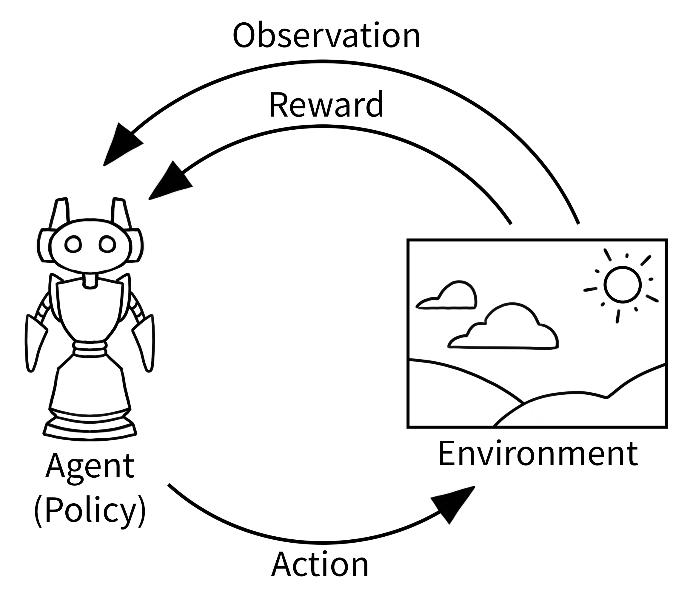

# RL Env

## 1. OpenAI Gymnasium

### 1.1 Agent-Environment Loop

In reinforcement learning:

1. **Agent** observes the current situation (like looking at a game screen)
2. **Agent chooses an action** based on what it sees (like pressing a button)
3. **Environment responds** with a new situation and a reward (game state changes, score updates)
4. **Repeat** until the episodes ends



```python
class Env():
  
  # Set this in SOME subclasses
  metadata: dict[str, Any] = {"render_modes": []}
  # define render_mode if your environment supports rendering
  render_mode: str | None = None
  spec: EnvSpec | None = None

  # Set these in ALL subclasses
  action_space: spaces.Space[ActType]
  observation_space: spaces.Space[ObsType]

  # Created
  _np_random: np.random.Generator | None = None
  # will be set to the "invalid" value -1 if the seed of the currently set rng is unknown
  _np_random_seed: int | None = None
  
  def step(
    self, action: ActType
  ) -> tuple[ObsType, SupportsFloat, bool, bool, dict[str, Any]]:
    """
    Args:
      action (ActType): an action provided by the agent to update the environment state.

    Returns:
      observation (ObsType): An element of the environment's :attr:`observation_space` as the next observation due to the agent actions.
      reward (SupportsFloat): The reward as a result of taking the action.
      
      NOTE
      terminated (bool): Whether the agent reaches the terminal state (as defined under the MDP of the task)
      * Tell the agent that all future rewards are zero! *
      truncated (bool): Whether the truncation condition outside the scope of the MDP is satisfied.
      * Tell the agent to bootstrap the value function for future rewards! *
      
      info (dict): Contains auxiliary diagnostic information (helpful for debugging, learning, and logging).
    """
  	raise NotImplementedError
    
	def reset(
    self,
    *,
    seed: int | None = None,
    option: dict[str, Any] | None = None,
  ) -> tuple[ObsType, dict[str, Any]]:
    """
    Args:
      seed (optional int): The seed that is used to initialize the environment's PRNG (`np_random`) and the read-only attribute `np_random_seed`.
      
    Returns: 
    	observation (ObsType): Observation of the initial state. This will be an element of :attr:`observation_space`
    	info (dictionary):  This dictionary contains auxiliary information complementing ``observation``. It should be analogous to the ``info`` returned by :meth:`step`.
    """
    # Initialize the RNG if the seed is manually passed
    if seed is not None:
        self._np_random, self._np_random_seed = seeding.np_random(seed)
 
  def render(self) -> RenderFrame | list[RenderFrame] | None:
    raise NotImplementedError
  
  def close(self):
    pass
```

## 2. Skrl

### 2.1 Env Wrapper 

```python
class Wrapper(object):
    def __init__(self, env: Any) -> None:
        """Base wrapper class for RL environments

        :param env: The environment to wrap
        :type env: Any supported RL environment
        """
        self._env = env
        try:
            self._unwrapped = self._env.unwrapped
        except:
            self._unwrapped = env

        # device
        if hasattr(self._unwrapped, "device"):
            self._device = config.torch.parse_device(self._unwrapped.device)
        else:
            self._device = config.torch.parse_device(None)

    def __getattr__(self, key: str) -> Any:
        """Get an attribute from the wrapped environment

        :param key: The attribute name
        :type key: str

        :raises AttributeError: If the attribute does not exist

        :return: The attribute value
        :rtype: Any
        """
        if hasattr(self._env, key):
            return getattr(self._env, key)
        if hasattr(self._unwrapped, key):
            return getattr(self._unwrapped, key)
        raise AttributeError(
            f"Wrapped environment ({self._unwrapped.__class__.__name__}) does not have attribute '{key}'"
        )

    def reset(self) -> Tuple[torch.Tensor, Any]:
        """Reset the environment

        :raises NotImplementedError: Not implemented

        :return: Observation, info
        :rtype: torch.Tensor and any other info
        """
        raise NotImplementedError

    def step(self, actions: torch.Tensor) -> Tuple[torch.Tensor, torch.Tensor, torch.Tensor, torch.Tensor, Any]:
        """Perform a step in the environment

        :param actions: The actions to perform
        :type actions: torch.Tensor

        :raises NotImplementedError: Not implemented

        :return: Observation, reward, terminated, truncated, info
        :rtype: tuple of torch.Tensor and any other info
        """
        raise NotImplementedError

    def state(self) -> torch.Tensor:
        """Get the environment state

        :raises NotImplementedError: Not implemented

        :return: State
        :rtype: torch.Tensor
        """
        raise NotImplementedError

    def render(self, *args, **kwargs) -> Any:
        """Render the environment

        :raises NotImplementedError: Not implemented

        :return: Any value from the wrapped environment
        :rtype: any
        """
        raise NotImplementedError

    def close(self) -> None:
        """Close the environment

        :raises NotImplementedError: Not implemented
        """
        raise NotImplementedError

    @property
    def device(self) -> torch.device:
        """The device used by the environment

        If the wrapped environment does not have the ``device`` property, the value of this property
        will be ``"cuda"`` or ``"cpu"`` depending on the device availability
        """
        return self._device

    @property
    def num_envs(self) -> int:
        """Number of environments

        If the wrapped environment does not have the ``num_envs`` property, it will be set to 1
        """
        return self._unwrapped.num_envs if hasattr(self._unwrapped, "num_envs") else 1

    @property
    def num_agents(self) -> int:
        """Number of agents

        If the wrapped environment does not have the ``num_agents`` property, it will be set to 1
        """
        return self._unwrapped.num_agents if hasattr(self._unwrapped, "num_agents") else 1

    @property
    def state_space(self) -> Union[gymnasium.Space, None]:
        """State space

        If the wrapped environment does not have the ``state_space`` property, ``None`` will be returned
        """
        return self._unwrapped.state_space if hasattr(self._unwrapped, "state_space") else None

    @property
    def observation_space(self) -> gymnasium.Space:
        """Observation space"""
        return self._unwrapped.observation_space

    @property
    def action_space(self) -> gymnasium.Space:
        """Action space"""
        return self._unwrapped.action_space
```

```python
class GymnasiumWrapper(Wrapper):
    def __init__(self, env: Any) -> None:
        """Gymnasium environment wrapper

        :param env: The environment to wrap
        :type env: Any supported Gymnasium environment
        """
        super().__init__(env)

        self._vectorized = False
        try:
            self._vectorized = self._vectorized or isinstance(env, gymnasium.vector.VectorEnv)
        except Exception as e:
            pass
        try:
            self._vectorized = self._vectorized or isinstance(env, gymnasium.experimental.vector.VectorEnv)
        except Exception as e:
            logger.warning(f"Failed to check for a vectorized environment: {e}")
        if self._vectorized:
            self._reset_once = True
            self._observation = None
            self._info = None
        

    @property
    def observation_space(self) -> gymnasium.Space:
        """Observation space"""
        if self._vectorized:
            return self._env.single_observation_space
        return self._env.observation_space

    @property
    def action_space(self) -> gymnasium.Space:
        """Action space"""
        if self._vectorized:
            return self._env.single_action_space
        return self._env.action_space

    def step(self, actions: torch.Tensor) -> Tuple[torch.Tensor, torch.Tensor, torch.Tensor, torch.Tensor, Any]:
        """Perform a step in the environment

        :param actions: The actions to perform
        :type actions: torch.Tensor

        :return: Observation, reward, terminated, truncated, info
        :rtype: tuple of torch.Tensor and any other info
        """
        actions = untensorize_space(
            self.action_space,
            unflatten_tensorized_space(self.action_space, actions),
            squeeze_batch_dimension=not self._vectorized,
        )

        observation, reward, terminated, truncated, info = self._env.step(actions)

        # convert response to torch
        observation = flatten_tensorized_space(tensorize_space(self.observation_space, observation, device=self.device))
        reward = torch.tensor(reward, device=self.device, dtype=torch.float32).view(self.num_envs, -1)
        terminated = torch.tensor(terminated, device=self.device, dtype=torch.bool).view(self.num_envs, -1)
        truncated = torch.tensor(truncated, device=self.device, dtype=torch.bool).view(self.num_envs, -1)

        # save observation and info for vectorized envs
        if self._vectorized:
            self._observation = observation
            self._info = info
        
        """NOTE: DEFAULT next-step Auto-Reset
        ENV[Terminated or Truncated] will save the final observation
        and auto-reset in next step function (before ENV step)
        Reference: https://gymnasium.farama.org/api/vector/#
        """

        return observation, reward, terminated, truncated, info

    def reset(self) -> Tuple[torch.Tensor, Any]:
        """Reset the environment

        :return: Observation, info
        :rtype: torch.Tensor and any other info
        """
        # handle vectorized environments (vector environments are autoreset)
        if self._vectorized:
            if self._reset_once:
                observation, self._info = self._env.reset()
                self._observation = flatten_tensorized_space(
                    tensorize_space(self.observation_space, observation, device=self.device)
                )
                self._reset_once = False
            return self._observation, self._info
          
        """NOTE: Auto-Reset will not be constrained by self._vectorized
        and the buffer(s,a,r,s‘) will not include the wrong buffer(s_n, a, r, s_1)
        (s_{n-1},  a, r, s_n), (s_1,  a, r, s_2) (ignore s_0)
        Reference: https://farama.org/Vector-Autoreset-Mode:
          import gymnasium as gym
          import numpy as np
          from collections import deque

          # Initialize environment, buffer and episode_start
          envs = gym.vector.SyncVectorEnv(
              [lambda: gym.make("CartPole-v1") for _ in range(2)],
              autoreset_mode=gym.vector.AutoresetMode.NEXT_STEP
          )
          replay_buffer = deque(maxlen=100)
          episode_start = np.zeros(envs.num_envs, dtype=bool)

          observations, _ = envs.reset()
          while True:   # Training loop
              actions = policy(observations)
              next_observations, rewards, terminations, truncations, infos = envs.step(actions)

              # Add to replay buffer
              for i in range(envs.num_envs):
                  if not episode_start[i]:
                      replay_buffer.append((observations[i], actions[i], \\
                      rewards[i], terminations[i], next_observations[i]))

              # update observation and if episode starts
              observations = next_observations
              episode_start = np.logical_or(terminations, truncations)
          envs.close()
        """

        observation, info = self._env.reset()
        observation = flatten_tensorized_space(tensorize_space(self.observation_space, observation, device=self.device))
        return observation, info

    def render(self, *args, **kwargs) -> Any:
        """Render the environment"""
        if self._vectorized:
            return self._env.call("render", *args, **kwargs)
        return self._env.render(*args, **kwargs)

    def close(self) -> None:
        """Close the environment"""
        self._env.close()
```

### 2.2 Agent Algorithm

